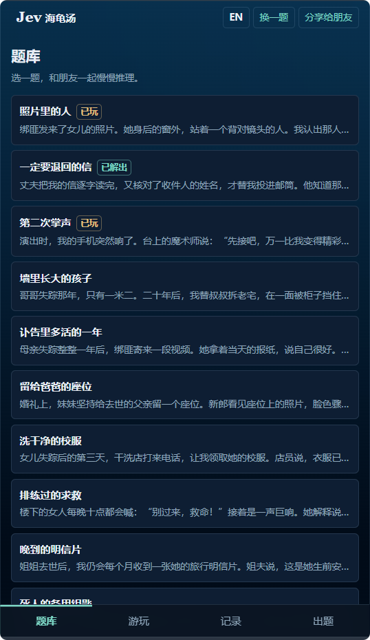
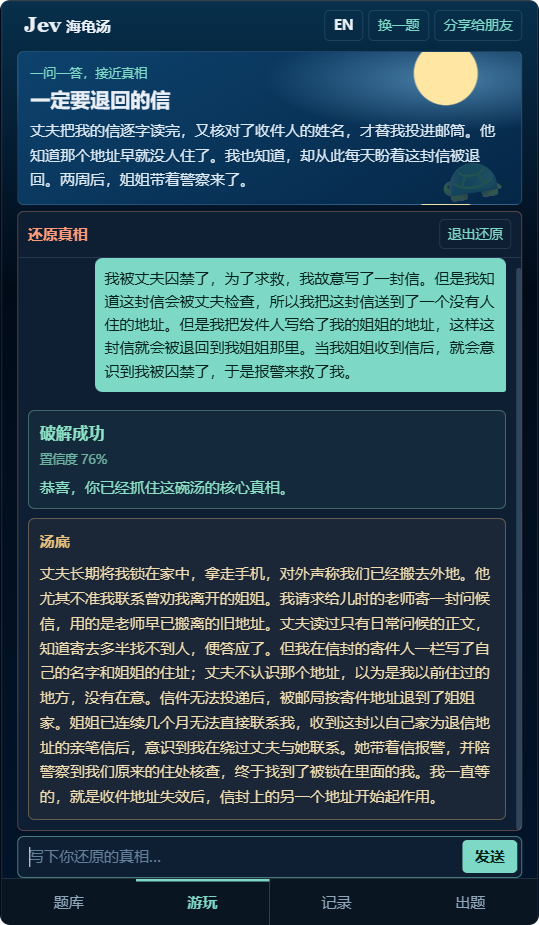

# Jev Turtle Soup 🐢

English | [中文](./README.md)

> A situation puzzle that talks back — with Jev, your AI game master.

[](./LICENSE)
[](https://nextjs.org)
[](https://workers.cloudflare.com)
[](https://opencode.ai/zen)

**👉 Play it live: <https://puzzle.xiaobaozi.cn>**

---

## What is this

A **situation puzzle** (known in Chinese communities as 海龟汤, "turtle soup") works like this: the game master knows the full truth behind a strange story (the "answer"), but only reads you its eerie beginning (the "puzzle"). You chip away at the truth with questions that can only be answered **Yes / No / Irrelevant**, then wrap up by retelling the whole story in your own words.

Jev Turtle Soup puts that experience on a mobile web page:

- Read the puzzle, then ask Jev things like *"Did she really die on the boat?"* or *"Was the killer someone she knew?"*
- Jev answers only **Yes / No / Irrelevant** — and honestly admits *"I can't determine that"* when unsure;
- Stuck? Unlock up to **three hints**, one at a time;
- Think you've got it? Hit **Reveal the Truth**, write down your theory, and Jev will judge it **Solved / Almost there / Not yet**;
- Completely lost? **Publish the Answer** and read the full story.

The main experience is a mobile-first website.

<p align="center">
<table>
  <tr>
    <td></td>
    <td></td>
  </tr>
  <tr>
    <td></td>
    <td></td>
  </tr>
</table>
</p>

---

## Highlights

| | |
|---|---|
| 🤖 **A game master that feels human** | Jev isn't scripted — every judgment goes to an LLM and comes back with a **Yes / No / Irrelevant** verdict plus a confidence score; when unsure, Jev says so instead of guessing and misleading you. |
| 📝 **Three ways to finish** | Unlock **hints** one by one, **publish the answer** to read the full story, or **reveal the truth** and let Jev vet your theory. |
| 📚 **Hand-picked built-in library** | Around 30 puzzles out of the box (classic rewrites + originals), each with three hints, spanning suspense, deduction and twist endings. |
| 🌍 **Bilingual: EN / ZH** | One tap to switch languages; every built-in puzzle ships with a full English story, answer and hints, and your choice is remembered. |
| 📊 **Local progress** | Played and solved puzzles are marked automatically and stored on the current device. No account is required. |
| ✍️ **Player submissions** | Write your own puzzle, answer and hints in the **Create** tab; Jev reviews it before it enters the public library, with a reason if it doesn't. |
| 📱 **Mobile-first** | The website is tuned for touch. |
| 🌗 **Ocean-night theme** | Dark base, rounded panels — easy on the eyes during long sessions. |

---

## The library

Classics, rewrites and originals live side by side, each with three hints. Source notes live in [`data/library-sources.md`](./data/library-sources.md) (Chinese).

> Classics: *The Person in the Photograph*, *The Letter I Wanted Returned*, *The Second Applause*, *The Child Who Grew Behind the Wall*, *A Year Too Late in the Obituary*…
>
> Originals: *The Flash in the Painting*, *Stop Calling My Name*, *The Wrong Stop*, *A Smile in the Subtitles*…

> Want to try it locally first? No backend keys needed:
>
> ```bash
> pnpm install
> cp .env.example .env.local        # leave NEXT_PUBLIC_API_URL empty
> pnpm dev
> ```
>
> Then open <http://localhost:3000> and play straight from the built-in library.

---

## Acknowledgments

- Classic situation puzzles come from public community sources (Minute Mysteries, Jed Hartman's situation puzzle archive, Braingle, Puzzling Stack Exchange, and others); sources and rewrite notes are documented in [`data/library-sources.md`](./data/library-sources.md).
- Judging is powered by [OpenCode Zen](https://opencode.ai/zen), using the `jev-1.13` model.
- Thanks to the community members of [Linux.do](https://linux.do/) for their long-term support and sharing.

---

## License

This project is open-sourced under the **GNU General Public License v3.0** — see the [`LICENSE`](./LICENSE) file.
