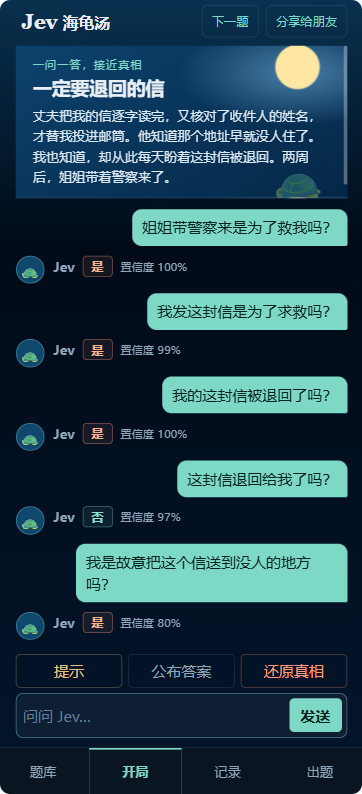

# Jev 海龟汤 🐢

> 一碗会自己聊的海龟汤 — 让 AI 主持人 Jev 陪你猜谜。

[](./LICENSE)
[](https://nextjs.org)
[](https://workers.cloudflare.com)
[](https://vercel.com/docs/ai-gateway)

---

## 这是什么

**海龟汤**是一种情境猜谜：主持人掌握一个故事的全部真相（"汤底"），只讲出离奇的开头（"汤面"）。玩家用「是 / 否 / 无关」的问题，慢慢逼近真相，最后用一段话还原整件事。

Jev 海龟汤把这个过程搬到了手机网页上：

- 你读一段汤面，问 Jev「她真的死在船上吗？」「凶手是熟人吗？」；
- Jev 只回答 **是 / 否 / 无关**，并在拿不准时坦白「无法确定」；
- 卡住了可以要 **三条提示**，逐条解锁；
- 觉得摸到真相了，就点 **还原真相**，把推理写下来，Jev 会判断 **破解成功 / 接近真相 / 还没猜对**；
- 实在不行，再点 **公布答案** 看汤底。

整个体验针对手机做了优化，可以丢进小红书 / B 站小程序里当壳工程，也可以直接当网页玩。



---

## 玩法演示（文字版）

```
┌───────────────────────────────┐
│ Jev 🐢 海龟汤   [下一题] [分享]│
├───────────────────────────────┤
│ 一问一答，接近真相             │
│ 《照片里的人》                  │
│ 绑匪发来了女儿的照片……         │
├───────────────────────────────┤
│ 🐢 我是 Jev，这碗汤的主持人。  │
│    大胆提问，我只回答是、否、无关 │
│                               │
│            照片是刚拍的吗？ 👤  │
│                               │
│ 🐢 是 · 置信度 92%             │
│                               │
│            我站在照片里吗？ 👤  │
│                               │
│ 🐢 是 · 置信度 86%             │
├───────────────────────────────┤
│ [提示 1/3]                     │
│ 照片是刚拍的。窗内窗外都是真人。│
│                       [←] [→]  │
├───────────────────────────────┤
│ [提示] [公布答案] [还原真相]   │
├───────────────────────────────┤
│ 问问 Jev…                  [发送] │
├───────────────────────────────┤
│ [题库] [开局●] [出题]          │
└───────────────────────────────┘
```

---

## 亮点

| | |
|---|---|
| 🤖 **真人感的 AI 主持人** | Jev 不是脚本，每次判断都交给 LLM，给出 **是 / 否 / 无关** 与置信度；低于 40% 一致性时主动承认「无法确定」，避免硬猜。 |
| 📝 **三种收尾方式** | 「提示」逐条解锁，「公布答案」一次性看汤底，「还原真相」用一段话跟 Jev 互验。 |
| 📚 **内置精挑题库** | 出厂自带约 30 道情境谜题（经典改写 + 原创），每题配有提示，覆盖悬疑、推理与反转。 |
| 📊 **个人答题记录** | 普通网页访客的记录保存在当前浏览器；小红书和 B 站小程序用户的记录保存在数据库。题库会标记已玩、已解出。 |
| ✍️ **玩家投稿** | 在「出题」写下汤面、汤底和提示；Jev 审核通过后进入公开题库，未通过会提示原因。 |
| 🛡 **管理员后台** | 访问 `/admin` 先通过浏览器原生账号密码验证，再复核、下架或删除投稿；操作有日志可查。 |
| 🔗 **一键分享** | 链接只包含后端题目 ID；朋友打开后由后端读取公开汤面，地址栏不包含汤底。 |
| 📱 **移动优先** | 单页布局，触屏流畅；可挂载到小红书 / B 站小程序壳工程。 |
| 🌗 **海洋夜色风** | 深色基底、圆角面板，长时间盯着屏幕也不刺眼。 |

---

## 一切怎么运转

```
┌──────────┐   提问    ┌─────────────────┐  评估请求  ┌─────────────────┐
│  玩家    │ ────────▶ │  Next.js 前端   │ ────────▶ │ Cloudflare      │
│ (网页/小 │ ◀──────── │  (Turbopack)    │ ◀──────── │ Worker + D1     │
│  程序)   │  是/否    └─────────────────┘  是/否     └────────┬────────┘
└──────────┘                          ▲                       │
                                       │ 判题走 Vercel AI      │
                                       │ Gateway  ──────────▶ │
                                       ▼                       │
                                ┌─────────────────┐             │
                                │ typesafe-ai/jev │ ◀───────────┘
                                │ (evaluation)    │
                                └─────────────────┘
```

- **汤底保密**：公开题库接口不返回答案；玩家主动公布答案，或被 Jev 判为破解成功后，才会收到汤底。
- **置信度阈值** (`JEV_CONFIDENCE_THRESHOLD = 0.4`)：低于阈值的判断一律改写为「无法确定」，宁可让 Jev 承认拿不准，也不让它猜错误导玩家。
- **Jev 共用模块**：`lib/jev.ts` 集中处理模型请求、失败后最多额外重试 2 次、选项校验和置信度；投稿审核、玩家提问和还原真相都调用它。Worker 与本地网页接口使用同一套判断规则。
- **身份无感**：普通网页首次访问会在本地浏览器生成一个标识，不向后端创建用户或会话；小红书、B 站小程序使用各自的 `open_id` 建立用户 ID。平台账号之间暂不自动合并。
- **答题记录**：网页访客的记录保存在当前浏览器的本地存储，清除浏览器数据后会消失；平台用户的记录写入 D1。Jev 判定「破解成功」且置信度达到 0.4 时标记完成。
- **题库双源**：内置题库写在 `data/library.json`，Worker 启动时覆盖种子行；玩家投稿经 Jev 二元审核后写入 D1，通过后公开，管理员仍可复核。

---

## 题库一览

精选 / 改写 / 原创三类并存，每题都附三条提示（不是阶梯式的「更明显 / 更明显」，而是三个不同角度）。题源说明见 [`data/library-sources.md`](./data/library-sources.md)。

> 经典：《照片里的人》《一定要退回的信》《第二次掌声》《墙里长大的孩子》《讣告里多活的一年》……
>
> 原创：《画里的闪光》《别再叫我的名字》《报错的家门》《笑着说的求救》……

> 想先玩一玩？直接拉起本地模式（不需要任何后端密钥）：
>
> ```bash
> pnpm install
> cp .env.example .env.local        # NEXT_PUBLIC_API_URL 留空
> pnpm dev
> ```
>
> 然后打开 <http://localhost:3000>，先用 `data/library.json` 里的内置题玩。

---

## 谁适合参与

- 想体验 AI 主持人的玩家；
- 想做 **小红书 / B 站小程序** 的独立开发者（仓库内有两个基础壳工程）；
- 对 **AI 评估式 (evaluation-model) 接口** 感兴趣的工程师；
- 想给海龟汤添题、添提示的同好 — 投稿即可。

---

## 谁可以参与开发

详见 [`AGENTS.md`](./AGENTS.md)（项目导览、目录结构、关键约定、本地启动）和 [`worker/README.md`](./worker/README.md)（后端、数据库迁移、首次部署、管理后台）。

简版启动：

```bash
# 前端（端口 3000）
pnpm install
cp .env.example .env.local
pnpm dev

# Worker（端口 8787，依赖 Cloudflare 账户）
pnpm --dir worker db:migrate:local
pnpm --dir worker dev
```

> 想自己架一套？记得申请 Vercel AI Gateway 密钥并在 `.env.local` / `.dev.vars` 填好。Vercel 账号需要绑定信用卡（用于流量计费），否则判题会 403。

---

## 安全与隐私

- 所有 AI 密钥保存在服务端，浏览器永远拿不到。
- 公开题库接口不返回汤底；判断在服务端对照数据库完成。
- 玩家投稿先由 Jev 检查色情和政治内容；通过才公开，未通过保留为已驳回。管理员可在后台复核、下架和删除。
- 每一次复核、下架、删除都会写入审核日志。

报告漏洞或建议，请走 Issue。

---

## 路线图

- [ ] 在真实小程序账号中完成登录、WebView 和审核联调
- [ ] 出题时给 AI 写一段自动提示生成器
- [ ] 复盘：玩家还原真相后给出 Jev 视角的差异点
- [ ] 多语言（先做英文，再看日语）

欢迎在 Issue 里提名新功能。

---

## 致谢

- 经典情境谜题来自社区公开资料（Minute Mysteries、Jed Hartman 情境谜题档案、Braingle、Puzzling Stack Exchange 等），题源与本项目改写说明见 [`data/library-sources.md`](./data/library-sources.md)。
- 判题服务由 [Vercel AI Gateway](https://vercel.com/docs/ai-gateway) 提供，使用 `typesafe-ai/jev` evaluation model。

---

## 许可协议

本项目采用 **GNU General Public License v3.0** 开源 — 详见 [`LICENSE`](./LICENSE) 文件。

简单说：你可以在遵守 GPL-3.0 的前提下自由使用、修改、分发；如果你发布了修改版，也必须以同样的协议开源。商业闭源分发不被允许。
