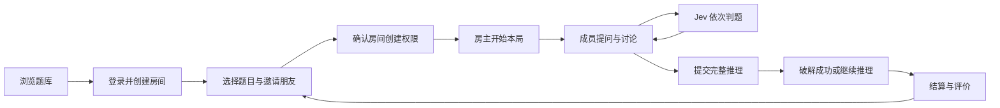

# PRD（产品需求文档）

## 1. 产品定位与价值

Jev 是供朋友一起玩的 AI 海龟汤游戏。玩家通过邀请链接进入同一房间，围绕一道悬疑故事提出问题，Jev 给出“是 / 否 / 无关 / 无法确定”，全员共享推理过程，最终共同还原真相。

赞助支持用户持续创建多人房间，与朋友共享无需安排真人主持人的组局体验。产品应持续积累三项资产：经过校验且有授权记录的题库、能被评测和改进的判题规则、愿意持续投稿的创作者。

| 人群 | 主要任务 | 关键体验 |
| --- | --- | --- |
| 组局房主 | 找一道好题，邀请朋友，顺利玩完 | 选题简单，开局价格明确，故障有处理 |
| 受邀玩家 | 快速加入，跟上推理，参与解谜 | 手机能玩，问题与答案对应，重连不丢记录 |
| 单人玩家 | 独自尝试或练习 | 无需登录、永久免费无限、记录留在本地 |
| 创作者 | 提交有趣的题目并获得反馈 | 草稿、试题、审核理由、作品表现可查看 |
| 运营者 | 保证内容质量、处理问题、控制成本 | 题目、房间、模型、订单都有可追踪记录 |

## 2. 首发用户旅程

受邀者打开链接可看到房间名、题目标题、人数和状态。完成登录后加入；登录后自动回到邀请房间。未赞助的受邀玩家也能正常参与，只有创建者使用开房权限。

单人入口与多人入口并列。单人玩家选题后直接游玩，无需注册、赞助或创建房间；全部对话、进度和提示状态保存在本地浏览器。模型请求经后端完成，但后端不保存单人对话、不关联账号，也不上传历史记录。具体见 [单人模式规格](08-SOLO.md)。

## 3. 房间与游戏规则

### 3.1 房间

- 首发为邀请制私密房间，不提供公开匹配大厅。房间 ID 与不可猜测的邀请令牌分开；房主可以重置邀请链接。
- 容量 1～8 人，含房主；成员按用户计算，多设备登录占同一名额。
- 等待中允许选题、邀请、移除成员、转让房主和解散。游戏中允许晚加入；新成员先加载本局汤面与全部公开记录。
- 每位用户最多处于一个进行中的房间；进入另一间前主动退出。退出后可通过有效邀请重入，被移除者由房主解除限制后才可重入。
- 房主连续离线 90 秒后，自动转给在线且最早加入的成员。无人在线时保留状态；全员离线 30 分钟后结束本局并关闭房间。
- 房主权限和房间创建者分别保存。转让房主不转移开房计数；同房间下一题不重复计数。
- 等待室在最后一次活动 24 小时后关闭；进行中不设固定游戏时长上限，全员离线 30 分钟后关闭。关闭后原成员可查历史，邀请链接无法再加入。

### 3.2 一问一答

- 每个问题展示提问者、原文、队列位置、Jev 判定和处理状态；答案固定显示在该问题下面。
- 成员可以同时提交，服务端按成功受理顺序编号。一个房间同一时刻只处理一个判题任务；不同房间可并行。
- 每人最多一个未完成的提问或还原任务。整个房间最多 8 个未完成任务，满额时按钮提示等待；限制在服务端执行。
- 提问最多 500 字，还原最多 1,500 字；超长输入直接提示修改。提交后文本不可编辑，可取消尚未开始处理的任务。
- 输入框明确区分“问 Jev”“和大家讨论”“还原真相”。讨论消息不调用模型，显示在独立讨论页签。
- “无法确定”是有效判题结果；调用失败显示“本次判断失败”，允许重新提交，不能把错误显示为“否”。
- 不显示模型概率作为玩家决策依据；后台保留置信度用于评测。玩家可以对某条判定举报“判断有误”。

### 3.3 提示、还原与结束

- 首发每题 3 条递进提示；房主解锁后全员可见。已解锁提示可以自由回看，不重复收费。
- 每个成员都能公开提交完整推理。还原与提问进入同一队列；结果为“破解成功 / 接近真相 / 还没猜对 / 无法确定”。
- 破解成功后全局结束，所有人收到汤底；尚未执行的任务取消。已经发出的旧模型请求即使晚返回，也不得修改结算结果。
- 房主可通过二次确认“公布答案并结束本局”；操作影响全员，结束后展示汤底。普通成员没有提前取得汤底的接口权限。
- 房主可直接结束并离开；不主动公布答案时，其他成员仅看到结束原因。运营因违规终止的房间不展示被下架内容。
- 单人和多人均不设单局提问或还原次数上限。多人采用有限队列和按人排队，避免某位成员连续提交占满主持人。
- 结算展示参与者、题目、耗时、有效提问数、提示使用数、结束原因；团队成功与个人参与分别记录，不以抢答排名刺激冲突。
- 下一局仍在同一房间，由房主选题开始，不重复扣开房次数；任何人不得把旧局问题提交到新局。

### 3.4 可见范围

| 内容 | 未登录访客 | 房间成员 | 创作者 | 后台人员 |
| --- | --- | --- | --- | --- |
| 已发布题目简介、汤面 | 可读 | 可读 | 可读 | 可读 |
| 汤底与未解锁提示 | 单人主动解锁后可读 | 本局授权解锁后可读 | 仅自己的作品 | 内容审核权限可读 |
| 房间对话 | 不可读 | 自己加入的局 | 无额外权限 | 调查权限且留下访问记录 |
| 支付记录 | 不可读 | 仅自己的订单 | 无额外权限 | 财务或客服按权限读取 |
| Jev 密钥与内部提示词 | 不可读 | 不可读 | 不可读 | 密钥不在管理页面明文展示 |

题目作者和服务器已有多人揭晓记录的玩家带“已知答案”标记；单人历史保持本地，不上传用于此标记。允许玩家自己标记已知答案。单人玩家可主动查看同一道题的答案，因此产品按朋友合作推理设计，不提供“无人提前知晓答案”的竞技保证。

## 4. 题库和 UGC（用户投稿）

- 题库支持难度、主题、预计时长、适玩人数、内容提醒、已玩状态筛选；开局前可见简介和汤面。
- 每道题记录核心事实、因果链、易误判问题、标准判定与递进提示。Jev 评测和人工审核共用这些材料。
- 题目内容发布后形成不可变版本；修改发布新版本，正在进行的游戏继续使用开局时的版本。
- 作品包括草稿、提交、自动检查、人工审核、通过发布、退回修改、下架状态。作者可查看具体理由、撤回待审版本、再次提交。
- 首发所有公开投稿必须人工批准；AI 提供辅助检查结果。商业授权和题目质量分别审核，均通过才能进入可收费题库。
- 投稿者需要声明原创或授权来源，并明确同意平台展示、主持服务使用和约定的商业使用范围。授权文本版本与同意时间保存。
- 作者可在本地试题界面测试自己的草稿；正文来自已保存且属于本人的作品，使用单人无对话持久化通道，不消耗开房次数、不设每日试题次数上限。作品与提交审核材料按创作功能保存，私人试题对话仅存浏览器。
- 玩家可以评价题目和举报判定、内容或侵权。只有完成或参与一定推理的用户可评价：默认本局至少提交 1 次有效判题，或在线参与满 5 分钟；每用户每题一条可修改评价。
- 不将当前“有来源链接”的旧题自动归类为可商用。现有 30 道题的来源说明明确缺少商业授权确认，应先做权利审查或补充自有内容。

## 5. 赞助方案

| 用户状态 | 单人游玩 | 创建多人房间 | 加入朋友房间 |
| --- | --- | --- | --- |
| 未登录 | 永久免费、无限；本地记录 | 登录后可创建 | 登录后可加入 |
| 登录未赞助 | 永久免费、无限；本地记录 | 每账号累计 10 个 | 免费，无次数消耗 |
| 6 元月度赞助有效 | 永久免费、无限；本地记录 | 有效期内不限次数 | 免费 |
| 20 元永久赞助 | 永久免费、无限；本地记录 | 永久不限次数 | 免费 |

开房次数按独立房间计：创建时预留，房间第一条有效 Jev 判定后正式消费；空房取消或未正常开始即故障关闭则释放。一个房间内切换题目不重复扣次。正常关闭后创建新房间才使用下一次机会。

赞助有效期在创建房间时确定；已创建的房间在赞助到期后仍可玩和换题，下次创建新房间重新检查。未使用的免费机会永久保留、不按月刷新，赞助期间不消耗。

首发默认主动付款续期，月度按一个自然月生效，永久授权无截止时间。具体续期、退款、重复付款和故障补偿见 [运营规格](05-OPERATIONS.md)。商业次数无限不改变每房 8 人、输入长度、队列容量和处理频率等技术参数。

目前没有支付商户资质：开发可推进订单、赞助授权、免费次数账本和后台；真实收款上线须完成商户与支付通道开通，以及支付、查单、退款的真实联调。测试阶段发放明确标记的测试赞助授权，不生成已付款订单。

## 6. 页面与交互品质

| 页面 | 主要内容 | 最重要操作 |
| --- | --- | --- |
| 首页 / 题库 | 精选、筛选、本地已玩标记、我的房间 | 单人开始、创建或返回房间 |
| 单人游戏 | 汤面、问答、本地历史、提示 | 提问、还原、查看答案 |
| 邀请页 | 房间信息、剩余人数、状态 | 登录并加入 |
| 等待室 | 成员、选题、权益说明 | 邀请、开局 |
| 游戏房间 | 汤面、成员状态、成对问答、提示 | 提问、讨论、还原 |
| 结算页 | 汤底、完整推理记录、评价 | 再来一局 |
| 创作中心 | 作品列表、编辑、私有试题、审核反馈 | 保存和提交 |
| 我的 | 账号、多人历史、赞助有效期、免费开房余量、订单 | 赞助、查订单、退出登录 |
| 管理后台 | 内容、用户、房间、模型、订单、审计 | 审核和处理异常 |

手机端：汤面可折叠，问答为主要内容，输入框始终可达；键盘弹起后不遮挡发送按钮。成员列表和提示用抽屉打开；题目、成员状态与当前输入模式的视觉层级高于装饰。桌面端：题目与成员在侧栏，问答主栏，讨论可并列展示。

视觉延续 Jev 的深海色系与青绿色品牌，但重做多人空间布局。正文默认 16px、触控区域至少 44px；判定同时显示文字与颜色，避免仅靠颜色区分。交互状态涵盖等待、排队、处理中、失败、重连、已结束和权限不足。尊重减少动画设置，保证键盘操作和屏幕阅读器能定位问答。

用户查看旧消息时收到新内容只出现“有新消息”，不强行滚动。发送中的内容先显示“正在提交”，拿到服务端受理结果后再加入正式记录。弱网时保留草稿；重试使用同一个请求编号。

## 7. 指标与成功判断

首发先建立基线，再设增长目标，不把预测数字写成已有业绩。

| 指标 | 定义 | 用途 |
| --- | --- | --- |
| 有效组局数 | 至少 2 个用户且产生 ≥5 次有效判定的局数 | 主产品使用量 |
| 邀请成功率 | 成功加入人数 / 打开有效邀请的去重访客数 | 发现登录和入房阻力 |
| 自然完成率 | 破解成功的局 / 产生有效判定的局 | 结合主动揭晓率评估题目难度 |
| 房主复玩率 | 首次有效组局后 7 天内再次开局的房主比例 | 留存 |
| 赞助转化 | 当期首次赞助人数 / 当期活跃登录房主人数 | 赞助价值；另观察用完 10 次者的转化 |
| 单局贡献 | 分摊收入－支付通道费用－模型成本－补偿成本 | 价格是否支持持续运营 |
| 判题争议率 | 举报且人工确认有误的判定 / 有效判定数 | 主持质量 |
| 投稿发布率与审核时间 | 发布作品 / 提交作品；提交至结论的时长 | 内容供给效率 |

多人事件中使用内部用户和房间编号，不收集完整聊天文本作为运营埋点。单人不采集账号、会话、设备指纹、对话或逐人游玩路径；仅保留不关联个人的总请求数、错误率、延迟与成本汇总。

## 8. 明确后续范围

小程序、App、公开匹配、语音、直播观战、好友关系、排行榜、作者现金分成、自动续费和多地区部署不进入首发。跨端共享接口、鉴权和权益；后续平台支付规则在接入时单独确认。
