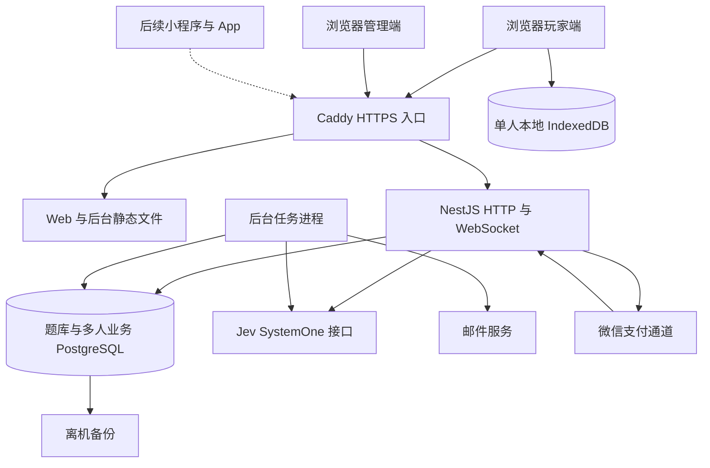

# SPEC（技术规格）：架构、数据与接口

## 1. 设计结论

采用 TypeScript（带类型约束的 JavaScript）统一前后端语言；React + Vite 提供浏览器应用，NestJS 提供独立后端，PostgreSQL 保存题库、多人房间、账号、赞助和运营状态。单人对话只存浏览器 IndexedDB（本地结构化数据库）。使用模块化单体：各业务代码边界清楚，首发作为同一个后端项目运行；多人模型任务在独立进程执行，单人调用直接通过不保存对话的 API 完成。

前后端独立构建和部署，在同一域名下通过反向代理分别提供 `/`、`/admin`、`/api/v1` 和 `/ws`。同域名便于安全保存登录状态，不影响未来客户端调用同一后端。

Jev、邮件与支付是外部依赖；“自有服务器部署”指产品前后端及数据库，不表示在本机部署 Jev 模型。

## 2. 技术选型和实际影响

| 层 | 选型 | 采用理由与边界 |
| --- | --- | --- |
| 用户前端 | React、Vite、React Router（路由）、TanStack Query（服务端数据缓存） | 复用 React 知识，独立静态部署；房间状态使用有序事件归并，不能只依赖查询缓存 |
| 玩家界面 | Radix UI（可访问交互组件）与项目样式变量 | 游戏界面按产品定制；用成熟组件处理弹窗、抽屉和焦点 |
| 管理端 | React-admin 社区版 | 提供列表、过滤、表单等基础能力；审核、退款和调查设计专门操作页，权限在后端执行 |
| API 服务 | NestJS + 默认 Express 适配器 | 模块、依赖注入、权限守卫、接口描述具备清晰约定；避免首发增加多套 HTTP 适配组合 |
| 数据访问 | PostgreSQL + Drizzle ORM（类型化数据库访问）；单人端使用 idb | 服务端事务、行锁、唯一约束承担多人及商业一致性；idb 封装浏览器 IndexedDB |
| 任务队列 | pg-boss（基于 PostgreSQL 的成熟任务库） | 多人判题、审核、查单、定时关闭使用持久任务；单人文本不进入队列；首发无需 Redis |
| 实时连接 | NestJS `WsAdapter` + `ws`，标准 WebSocket | 浏览器与后续小程序可使用标准协议；重连和补齐使用本文规定的持久事件接口 |
| 身份 | Better Auth + Email OTP（邮箱验证码）+ Google OAuth（第三方授权） | 会话与协议使用成熟库；房间、内容、财务权限由业务服务判断 |
| 契约 | Zod（运行时结构校验）+ OpenAPI + JSON Schema | 输入先校验再执行；HTTP 客户端按契约生成，客户端不引用服务端机密类型 |
| 部署 | Docker Compose + Caddy（HTTPS 与反向代理） | 单服务器可运维、可备份、可回退；玩家端与管理端单独构建 |
| 验证 | Vitest、Playwright、真实 PostgreSQL | 纯规则测试与真实数据库并发测试分工；浏览器测试覆盖多人行为 |

这些框架能力已核对官方资料：[Vite](https://vite.dev/guide/)、[NestJS WebSocket 适配器](https://docs.nestjs.com/websockets/adapter)、[Drizzle](https://orm.drizzle.team/docs/overview)、[pg-boss](https://github.com/timgit/pg-boss)、[Better Auth](https://better-auth.com/docs/introduction)、[React-admin](https://marmelab.com/react-admin/documentation.html)。实现前锁定互相兼容的稳定版本，提交锁文件，生产构建使用冻结依赖安装。

建议 Node.js 采用实施时仍受支持的长期支持版本，并核对 Vite、NestJS、Better Auth 与 pg-boss 的要求。本文不把未安装的版本号写成已验证组合。

保留 Next.js 自托管也是可行方案。此次选 Vite 的原因是产品主要为登录后的实时应用，用户明确希望前后端分离；代价是现有 Next.js 路由需要迁移，首发不提供题目页面服务端渲染。营销与搜索流量有明确需求后，再增加独立预渲染页面。

## 3. 代码目录与边界

| 目录 | 内容 |
| --- | --- |
| `apps/web` | 玩家端：单人游戏、题库、多人房间、创作、赞助与订单 |
| `apps/admin` | 管理端：审核、运营、财务、用户与审计 |
| `apps/api` | NestJS HTTP、身份接入、WebSocket 网关 |
| `apps/jobs` | 同一后端领域模块的任务进程入口 |
| `packages/contracts` | 公开输入、输出、事件 Schema 与生成客户端 |
| `packages/domain` | 房间、内容、计费规则；不依赖网页或 NestJS 控制器 |
| `packages/database` | Drizzle 表结构、按时间追加的迁移、事务封装 |
| `packages/jev` | 仅服务端可引用的 Jev 适配、提示词、验证与评测 |
| `packages/ui` | 可复用的网页组件、样式变量与交互规范 |
| `packages/i18n` | 稳定状态码对应的中英文文案 |
| `scripts/migration` | 旧数据导入、校验、对账 |
| `infra` | 容器编排、代理配置、备份与部署流程 |

`packages/contracts` 不导出含汤底的数据库行类型。客户端只得到用途明确的公开结构；内部类型和外部类型分别定义。禁止玩家端导入 `packages/database`、`packages/jev` 或含汤底的种子文件，构建时检查此边界。

## 4. 模块职责

| 模块 | 负责 | 禁止跨越的边界 |
| --- | --- | --- |
| Identity（身份） | 登录、会话、账号状态、绑定身份 | 不关联普通单人游玩、不直接修改开房计数 |
| Catalog（题库） | 作品、版本、公开检索、来源与授权 | 不把未发布汤底传给普通查询 |
| Creation（创作） | 草稿、提交、试题、审核流程 | 作者不能直接发布 |
| Rooms（房间） | 成员、游戏状态、队列、事件、历史 | 客户端不能决定顺序或终态 |
| Solo（单人） | 匿名判题通道、浏览器历史和本地进度 | 不创建服务端会话/房间/对话记录 |
| Jev（主持） | 请求构造、结果校验、调用记录、评测 | 不自行扣费或结束房间 |
| Billing（赞助与账务） | 订单、赞助有效期、免费开房次数、退款、对账 | 不相信前端付款结果，不干预单人模式 |
| Operations（运营） | 审核、举报、调查、配置与审计 | 所有操作经相应领域服务执行 |

## 5. 数据模型

统一使用 UUID 作为业务主键，金额使用最小货币单位整数，时间存 `timestamptz`（带时区时间）；业务展示使用上海时区。所有引用建立外键；财务和审计数据禁止级联删除。公开文本通过长度和结构校验，以纯文本渲染。

### 5.1 身份与内容

| 表 | 关键字段与约束 |
| --- | --- |
| 认证库管理的 user/session/account/verification 表 | 按所锁定 Better Auth 版本生成；账号与业务 profile 一对一，不手写替代认证协议 |
| `profiles` | `user_id`、昵称、账号状态、创建时间；状态 active/suspended/deletion_pending |
| `role_assignments` | `user_id`、角色；用户与角色唯一 |
| `puzzles` | 作品 ID、作者用户 ID（旧题可为空）、来源类型、当前发布版本指针、可用状态 |
| `puzzle_versions` | 作品、版本号、语言、标题、汤面、汤底、提示、核心事实、因果链、难度、时长、内容提醒、审核状态；`(puzzle_id, version_no, language)` 唯一；提交后不可变 |
| `puzzle_rights` | 作品/版本、权利状态 pending/approved/rejected、来源链接、授权依据、协议版本、确认人和时间 |
| `puzzle_test_cases` | 版本、问题或还原、预期判定、理由、关键程度、人工确认人 |
| `moderation_reviews` | 版本、阶段、结论、理由、操作者、自动模型版本、时间 |
| `reports` | 举报人、对象类型与 ID、原因、处理状态、处置记录 |
| `ratings` | 用户、作品、评价、关联已参与局；用户与作品唯一 |

首发业务只发布中文；旧英文迁为对应语言版本并保留翻译关系。每局固定语言与版本，不能由单个成员切换游戏语言；界面语言独立。

### 5.2 房间与任务

| 表 | 关键字段与约束 |
| --- | --- |
| `rooms` | 创建者、房主、状态 waiting/playing/closed、容量、邀请令牌散列、当前局、开房授权 ID、`last_seq`、控制版本号、闲置关闭期限 |
| `room_members` | 房间、用户、成员状态 joined/left/kicked、加入时间、最近活动；`(room_id,user_id)` 唯一 |
| `active_room_users` | `user_id` 唯一、room_id；实现每人最多一个当前房间；明确退出和关闭时删除 |
| `rounds` | 房间、轮次、固定题目版本、状态、提示进度、有效判定数、开始/结束时间、终止原因、取消代次；不按局扣开房次数 |
| `round_participants` | 局、用户、加入/退出时间、已知答案标记、阅读权限；保存历史参与范围 |
| `commands` | 用户、请求编号、请求内容摘要、房间/局、处理结果；`(user_id,client_request_id)` 唯一，所属局进行中保留，结束后至少 30 天 |
| `turns` | 局、提问者、类型 ask/solve、文本、序号、状态、结果、失败原因、执行令牌、重试次数、截止时间 |
| `room_events` | 房间、递增序号、事件 ID、局、事件类型、公开内容、创建时间；`(room_id,seq)` 唯一 |
| `jev_calls` | 仅多人 turn/review 引用、调用编号、模型/提示词版本、开始结束时间、状态、置信度、用量、成本来源、错误类别；单人仅匿名汇总 |
| pg-boss 自有表 | 任务、调度、重试、死信；由库管理，不直接写内部字段 |
| `audit_logs` | 操作者、动作、对象、理由、前后摘要、关联请求编号、时间；追加写 |

讨论内容放入 `room_events` 的 discussion.created（讨论已发布）事件中；问答原文保存在 `turns`，事件携带公开投影。历史列表从规范记录查询，避免长期通过重放全部事件构建页面。

额外数据库约束：同一局最多一个 processing（处理中）任务；同一局同一用户最多一个 queued/processing（排队/处理中）任务；同一房间最多一个进行中局；同一创建者最多一个未关闭房间。通过 PostgreSQL 部分唯一索引实现，ORM 不支持的约束用版本化 SQL 迁移。

### 5.3 赞助与支付

| 表 | 关键字段与约束 |
| --- | --- |
| `sponsor_products` / `product_versions` | monthly/lifetime 类型、版本、价格币种、有效期规则、上架状态；初始价格 600/2000 分；已售版本不可变 |
| `orders` | 用户、商品版本快照、金额币种、渠道、状态、商户单号、过期时间；商户单号唯一 |
| `payment_transactions` | 渠道交易号、订单、验证金额、结果；`(channel,transaction_id)` 唯一 |
| `payment_notifications` | 渠道通知 ID、原文摘要、验签结果、处理结果；通知 ID 唯一，敏感原文加密限期保存 |
| `sponsor_accounts` | 用户唯一、月度锚点、版本号；统一锁定授权变动与开房 |
| `sponsor_grants` | 用户、订单 ID、monthly/lifetime/test 类型、生效/结束时刻、冻结/撤销状态；正式订单 ID 唯一，永久结束为空；月度区间不重叠 |
| `free_room_accounts` | 用户唯一、total=10、consumed、reserved，CHECK 保证非负且消费与预留之和 ≤10 |
| `room_entitlements` | 房间唯一、创建者、来源 free/sponsorship/test、赞助授权 ID、状态 reserved/consumed/released/refunded；一个房间一个授权 |
| `room_credit_ledger` | 房间、用户、reserve/consume/release/refund 类型、数量、关联记录；`(room_id,action)` 唯一 |
| `sponsor_ledger` | 订单或补偿事故、授权、grant/freeze/revoke/extend、有效期变化；业务动作幂等键唯一 |
| `refunds` | 订单、退款编号、金额、理由、状态、权益处理状态；退款编号唯一 |

免费可开房数 = 10－已消费量－预留量。行锁内优先检查有效且未冻结的赞助授权；无赞助时才预留免费次数。流水和计数同事务提交；赞助授权不生成月度额度，也不限制单局判题次数。单人接口不得查询这些表。

## 6. HTTP 契约

接口前缀 `/api/v1`。除认证库标准端点外，成功返回 `data` 和 `requestId`；失败返回 `error.code`、面向用户的 `message`、`requestId`，不返回堆栈、SQL 或模型原文。列表使用游标和 `limit`（默认 20、最大 100）。

多人和商业写操作使用 `Idempotency-Key`（幂等编号，即重复发送同一操作只执行一次）。赞助/退款业务幂等记录随订单长期保留；游戏命令保留到所属局结束后至少 30 天，进行中不删除。单人不保存服务端幂等记录，前端避免重复提交，详见单人规格。

| 方法与路径 | 行为与权限 |
| --- | --- |
| `/auth/*` | Better Auth 认证路由；验证码、Google 回调、会话遵循认证库契约 |
| `GET /me`、`GET /me/history` | 当前账号与个人参与历史 |
| `GET /puzzles`、`GET /puzzles/:id` | 仅公开题面与检索元数据，无答案和隐藏提示 |
| `POST /solo/sessions` | 匿名获取固定题目版本的无状态签名凭证，不落会话表 |
| `POST /solo/judge`、`POST /solo/solve` | 匿名单人判断，内存处理，不存正文和逐次调用记录 |
| `POST /solo/hints`、`POST /solo/reveal` | 单人主动取得提示或答案；不读取和改变多人局 |
| `POST /rooms` | 登录用户创建等待室，记录赞助授权或预留免费次数，尚不正式消费 |
| `GET /invites/:token` | 最小邀请预览，限速；无完整成员资料 |
| `POST /rooms/join` | 邀请令牌入房；锁房间检查人数及封禁 |
| `GET /rooms/:id/snapshot` | 当前有权成员获取一致快照与 `lastSeq` |
| `GET /rooms/:id/events?afterSeq=...` | 有权成员补齐当前局事件；超出保留范围返回 410 要求快照 |
| `POST /rooms/:id/commands` | 见下表；服务端逐项检查身份、局、状态和队列容量 |
| `POST /realtime/tickets` | 当前会话换取 30 秒一次性实时鉴权票据 |
| `GET /rounds/:id/history` | 本局有阅读权的参与者查询问答与讨论分页 |
| `GET /rounds/:id/answer` | 仅正常揭晓或破解结束后，有权参与者获取固定版本答案 |
| `POST /creations`、`PATCH /creations/:id` | 作者保存自己的草稿，使用版本条件避免覆盖 |
| `POST /creations/:id/submit`、`POST /creations/:id/withdraw` | 提交不可变审核版本或撤回 |
| `POST /creations/:id/test-session` | 校验作者后签发私有试题凭证，单人试题对话仅本地保存 |
| `GET /sponsorship`、`GET /sponsor-products` | 当前赞助有效期、免费开房余量、600/2000 分商品 |
| `POST /orders`、`GET /orders/:id` | 创建赞助订单、仅本人查单；服务端计价 |
| `POST /payments/:channel/notify` | 通道回调，原始请求体验签；不使用用户会话 |
| `POST /refund-requests` | 本人提出退款申请；财务审核与通道执行分离 |
| `POST /reports`、`PUT /ratings/:puzzleId` | 举报与满足条件的评价 |
| `/admin/*` | 角色守卫与审计；具体操作见运营文档 |
| `GET /health/live`、`GET /health/ready` | 进程存活与数据库/任务基础就绪，不暴露密钥 |

### 房间命令

每条命令含 `clientRequestId`、`type`、需要时的 `roundId`、`payload`。控制命令附 `expectedControlVersion`（期望控制版本）；讨论和判题提交不因成员活动变动产生无意义冲突。

| 命令 | 权限 | 额外条件 |
| --- | --- | --- |
| `select_puzzle`（选题） | 房主 | 等待中，版本已发布可用 |
| `start_round`（开始一局） | 房主 | 无进行中局，房间未关闭且创建授权有效；不重复预留次数 |
| `ask` / `solve`（提问/还原） | 本局成员 | 进行中，未达频率与排队上限，无累计问题额度 |
| `cancel_turn`（取消） | 提问者 | 仅排队任务 |
| `discussion`（讨论） | 本局成员 | 进行中，最多 1,000 字，限速 |
| `reveal_hint`（提示） | 房主 | 进行中，仍有未解锁提示 |
| `reveal_answer`（公布答案） | 房主 | 二次确认的有效命令，原子结束 |
| `end_round`（结束本局） | 房主 | 进行中，无答案揭晓 |
| `leave` / `kick`（离开/移除） | 本人 / 房主 | 房主主动离开先转让或关闭 |
| `transfer_host`（转让房主） | 房主 | 目标为当前在线成员 |
| `rotate_invite`（重置邀请） | 房主 | 房间未关闭 |
| `close_room`（关闭房间） | 房主 | 若有进行中局，同事务终止 |

关键错误码：`ROOM_FULL`、`ROUND_ENDED`、`SPONSORSHIP_REQUIRED`、`FREE_ROOMS_EXHAUSTED`、`TURN_PENDING`、`QUEUE_FULL`、`STATE_CONFLICT`、`IDEMPOTENCY_CONFLICT`、`JEV_UNAVAILABLE`、`CONTENT_UNAVAILABLE`。分别使用 409 状态冲突、403 权限不足、429 频率限制、503 外部服务不可用等合适 HTTP 状态，客户端按稳定错误码翻译。单人永远不返回赞助要求或免费次数耗尽。

## 7. 一致性、任务与实时发送

游戏命令、状态修改、事件追加、所需任务创建必须在同一个 PostgreSQL 事务中提交。使用 pg-boss 官方事务适配；M0 验证 Drizzle 事务与队列写入确实共享连接。禁止提交业务后再以无持久记录的异步调用创建任务。

锁顺序统一：房间 → 当前局 → 用户赞助账户 → 免费开房账户 → 任务。新建房间先锁用户账户再插入新房间，事务内不读取其他已有房间锁；退款只锁订单、用户授权账户，不反向请求房间锁。已经创建的房间保留创建时授权。短事务保护状态转换；外部 Jev 与支付 HTTP 调用期间不持有数据库锁。[PostgreSQL 行锁说明](https://www.postgresql.org/docs/current/explicit-locking.html)。

数据库事件表同时承担可靠发送记录：事务提交后通知网关有新序号，网关查事件并广播。数据库通知只是唤醒机制；网关每秒扫描已订阅房间的最新序号，补发遗漏记录。即使提交后进程崩溃，恢复后仍可从事件表发送。客户端按序号去重和补齐，不能把 WebSocket 连接存在等同于消息已完整收到。

## 8. 部署与运行

首发容器：Caddy、API、Jobs、PostgreSQL。数据库和任务内部端口仅内网可达；公网只暴露 HTTPS。静态资源用内容散列缓存，入口 HTML 短缓存；API、私有历史与答案使用 `Cache-Control: no-store`。

环境配置包括数据库地址、登录密钥、Google 客户端凭据、邮件服务参数、Jev 密钥与地址/模型、支付凭据、允许域名、环境标识。公开前端配置只含公开地址和构建版本；密钥不进入镜像和仓库。必需配置缺失时对应进程启动失败并给出明确日志；显式测试版配置可以关闭支付入口。

Jev 地址与模型可配置，但默认保持现有 SystemOne 接口与 `jev-1.13`，M0 实测确认。国内服务器到 Jev 的连通性是上线前置条件；服务端部署位置本身不能保证该外部调用可用。

API、任务进程独立重启。发布先跑追加式数据库迁移，再部署兼容新旧结构的应用，最后清理过渡字段。进程停止时停止接受新任务，等待已开始任务到截止时间，关闭长连接让客户端重连。版本必须能容忍滚动期间重复事件。

多人和业务日志使用 `requestId`、`roomId`、`roundId`、`turnId`、`orderId`、错误码和耗时。不得记录验证码、会话、密钥、完整支付敏感数据或完整汤底。单人路径关闭访问明细、请求/响应捕获、追踪明细和会话回放，仅输出匿名聚合指标。监控区分 API、邮件、支付与 Jev 故障；设置付款未发权益、计数异常、事件延迟、长任务积压、备份过期告警。

保留策略初始建议：多人房间记录在房间关闭后保留 90 天，进行中保留全部记录；同步事件至少覆盖进行中局及结束后 7 天，普通技术日志 30 天。赞助与财务记录按实际法定和财务要求确定，在确认前不自动删除。保留期在用户协议中展示。单人服务端不保存对话，浏览器由用户清理或浏览器存储机制决定。账号注销先关闭会话和可识别展示数据，必要财务记录限制访问保存。

## 9. 跨端扩展约束

小程序和 App 复用 API、事件协议与类型契约，不直接复用浏览器 DOM 组件。标准 WebSocket 在各端使用官方连接接口，服务端仍执行同一授权与恢复逻辑。未来客户端框架在开发该端时验证后选择。

网页使用 HttpOnly 安全 Cookie 保存会话；后续原生端通过认证库已验证的令牌模式接入，令牌存系统安全存储，不把网页 Cookie 字符串当通用跨端协议。微信身份以独立第三方 identity 绑定用户 ID，微信支付身份与登录身份分开建模。

赞助权益以服务器为准；不同平台购买渠道保留来源。App 和小程序的数字内容支付要求需在其上线前核实；本期不承诺网页支付入口能直接嵌入所有平台。
