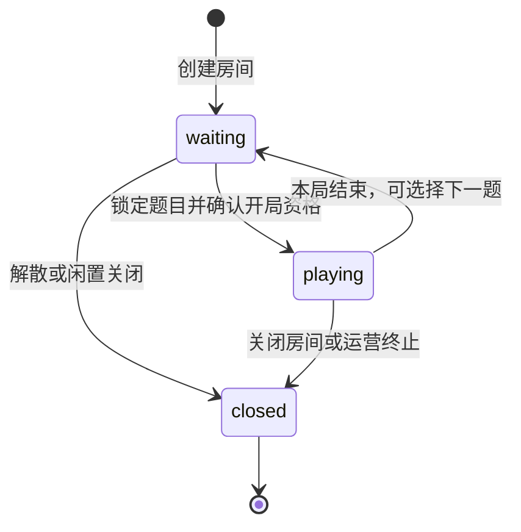
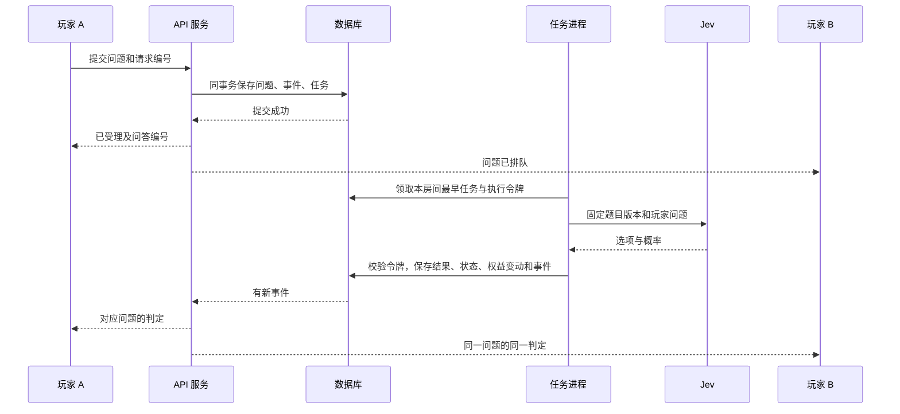

# 房间同步与 Jev 主持协议

## 1. 必须一直成立的规则

1. 服务端决定房间状态、顺序、判定和揭晓。客户端发送意图，不能提交权威答案或余额。
2. 一个问题有一个 `turnId`（问答编号），最多一个正式结果。问题和结果始终引用同一编号。
3. 一个房间同一时刻只有一个 Jev 游戏任务在正式处理；不同房间允许并行。
4. 房间事件有连续递增 `seq`（序号）。客户端按序号应用，重复事件忽略，出现缺口先补齐。
5. 命令只有持久化成功才算受理。收到请求、写入成功、模型完成是三个独立状态。
6. 每局固定题目版本、语言、模型及提示词配置版本；旧任务结果不能写入新局。
7. 所有人单人游玩和单局判题无限；赞助有效时不限创建多人房间次数。排队、频率和并发参数用于保持服务正常。
8. 未赞助账号初始可累计创建 10 个多人房间。创建等待室先预留；房间首次有效判定才确认消费，同一房间换题不再计次。

本文的持久化、幂等、事件和任务队列规则用于多人模式。单人调用共享 Jev 适配器，采用 [独立的本地记录方案](08-SOLO.md)。

## 2. 状态机



局状态：active（进行中）→ solved（破解）、revealed（主动揭晓）、abandoned（主动结束/全员离线）、aborted（系统或运营中止）。终态不可逆。暂停接收新任务使用独立服务状态，不把故障写成“还没猜对”。

问答状态：queued（排队）→ processing（处理）→ succeeded（成功）或 failed（失败）；queued 可转 cancelled（取消）。局结束时 queued 和 processing 都转 cancelled；外部请求尽力取消，迟到结果只能进入调用诊断记录。

## 3. 提交和排队

HTTP 命令示例：

```json
{
  "clientRequestId": "6e80ad00-10ea-4d61-9252-a285d1200865",
  "type": "ask",
  "roundId": "83a76f1d-a038-4308-9985-9b87cc353cce",
  "payload": { "text": "他认识餐厅里的厨师吗？" }
}
```

`clientRequestId` 在用户点击发送时生成，网络重发沿用它；`roundId` 防止旧页面把问题发到下一局。服务端不接受客户端提供的 userId、汤底、判题结果或收费来源。

受理事务步骤：

1. 校验会话、账号状态、成员资格、文本结构与限速。
2. 检查幂等编号。相同用户、编号和内容返回原结果；同编号不同内容返回冲突。
3. 锁定房间和当前局，验证 roundId、active 状态和当前成员；检查个人未完成任务数、房间队列上限。正文幂等编号与请求头必须一致，避免两套编号指向不同命令。
4. 创建 turn，分配房间事件序号，追加 turn.accepted（问答已受理）事件。
5. 同事务创建或唤醒房间调度任务，保存命令受理结果，再提交事务。
6. 返回 202，含 turnId、acceptedSeq、status=queued；网关向全体有权成员发事件。

排队按 turn.accepted 的事件序号递增，不按客户端时间排序。每人一个未完成任务、房间最多 8 个；超出容量返回可重试的明确错误。讨论每人每秒最多一条、每分钟最多 30 条，首发参数需根据真实体验调整。

## 4. 模型工作进程



领取与完成各使用短事务。领取时锁房间/局，选最早 queued，写入 processing、随机执行令牌、`leaseExpiresAt`（占用期限）和固定配置。模型请求在事务外执行。工作进程完成时再次锁房间/局，只有以下全部匹配才能提交：本局 active、turn processing、执行令牌一致、取消代次未变化、未超执行截止时间。

期限设置：单次调用 20 秒，最多额外重试 1 次，总执行 45 秒，领取占用期限 60 秒。排队超过 60 秒未开始，标记 failed 并通知用户；该任务不消耗有效判题计数。

任务进程异常退出后，pg-boss 负责重投递；领域层检查原占用期限。期限未到时只延迟重试，不能并行重领。期限到达后旧令牌失效，原任务标记失败；由用户重新提交新的任务。后台恢复巡检每 5 秒按状态/截止时间索引检查超期排队、失效 processing 和有排队却无调度任务的房间，补齐状态与调度，不扫描全部历史。后续调度继续处理其他 queued 任务。

每次结果事务同时处理：turn 最终结果、整个房间首个有效判定对免费开房预留的消费、有效判题计数、必要的整局结束、后续任务取消、公开事件、下一任务调度。依赖唯一约束和状态条件防止重复；之后任何局都不重复扣开房次数。

供应商请求可能在网络超时后已经执行。未确认其支持幂等前，只保证本系统一份正式结果和一次权益消费，不能承诺供应商只计费一次。每次真实尝试记录独立调用 ID，禁止队列库重试与内部重试叠加成无限请求。

## 5. 实时连接与恢复

写操作统一 HTTP；WebSocket 用于订阅事件、心跳、确认收到与断线恢复。这样各客户端可以复用同一套写接口和幂等逻辑。

连接流程：已登录用户请求一次性票据 → 建立 `wss://域名/ws` → 5 秒内发送鉴权帧 → 服务端核销票据并验证会话 → 提交房间订阅及 lastSeq。票据不放 URL，30 秒失效，只能使用一次；鉴权帧不得写入日志。

标准事件示例：

```json
{
  "schemaVersion": 1,
  "eventId": "b679fbe8-c431-4f8f-88fe-f4f9eedcd305",
  "roomId": "09dc85a1-b916-46c6-aa19-14b750164594",
  "roundId": "83a76f1d-a038-4308-9985-9b87cc353cce",
  "seq": 42,
  "type": "turn.completed",
  "occurredAt": "2026-09-25T08:00:00Z",
  "payload": {
    "turnId": "a407c20c-7322-4ce2-b56f-3473e2c22711",
    "result": "yes"
  }
}
```

该示例表达“第 42 条房间事件把一个指定问题的结果更新为是”。玩家不会看到另一条漂浮在聊天末尾、无法辨认对应问题的回答。

事件最小集合：room.member_joined / member_left / member_kicked / host_changed / closed；round.started / ended；turn.accepted / started / completed / failed / cancelled；hint.revealed；discussion.created。所有事件使用对应 Schema 校验。金额、赞助有效期、免费余量通过个人接口读取，不广播给房间其他成员。

### 无缺口的快照握手

1. 网关登记该连接的订阅意图，暂存随后到来的事件，但尚不向客户端宣布已同步。
2. 用 PostgreSQL 可重复读事务读取房间、局、成员、已解锁提示及问答首屏，取得对应 `lastSeq=S`。
3. 给客户端快照；客户端替换该房间的权威状态，将本地游标设为 S。
4. 从数据库查询 seq>S 的事件，按升序发送；合并握手期间的缓存，重复序号忽略。
5. 达到本次读取的高水位后发送 sync.ready（同步完成），才开放写操作。历史问答分页读取，以固定游标避免重复。

恢复时携带最后连续应用的序号。服务端先验证当前成员阅读权，再补事件；游标早于保留范围、早于本局边界、超过服务端序号或协议版本不兼容时要求重新快照。新加入成员的快照只含本局，不能借房间历史序号读取加入之前的旧局。分页允许跨越无权事件的范围时，服务端明确返回下一授权游标，客户端不能自行推测权限缺口。

每 15 秒发送应用心跳，每 5 秒广播当前房间高水位；客户端发现高水位领先但未收到事件，主动补齐。超过 45 秒无响应视为离线。重连采用带随机抖动的指数退避，最大间隔 15 秒；浏览器重新可见时立即检查同步。

成员资格在每次写入、订阅、补齐和发送事件前核实；网关处理踢人/封禁时清理订阅并关闭连接。已从服务器取得的数据无法从玩家设备撤回，后续访问必须阻断。

## 6. 成员变化与游戏结束

- 在线状态按用户聚合所有有效连接。多标签页只要有一个活跃连接便视为在线；新设备不创建第二个成员。
- 房主离线 90 秒的转让任务锁定房间，再检查当前房主、连接状态和候选成员。房主已经回线则任务无操作结束。
- 排队中的用户主动退出或被移除，取消其 queued 任务；processing 任务保留已提出的公共问题，可正常完成，但不给退出/被移除用户额外读取权限。
- 主动退出仍保留本人已参与局的历史阅读权；被移除或账号封禁撤销该房间读取权。后台调查使用独立权限和审计。
- 正常结算只给曾参与该局且仍有阅读权的账号看答案。旧邀请不能让陌生人在结束后取得历史汤底。
- 房主提前揭晓、模型判定成功、运营中止在同一房间锁下竞争，最先提交的终态生效，其他操作收到状态冲突。
- `rounds.cancel_generation` 每次终止加一，所有未完成结果都须检查它。它相当于给旧请求盖上“已作废”的标记。

房间没有商业性的固定时长上限。全员离线 30 分钟后结束并关闭；等待室无活动 24 小时后关闭。进行中的成员活动更新 lastActivityAt，不因创建时间较早而终止活跃游戏。

## 7. Jev 适配与判题标准

复用当前 `lib/jev.ts` 的 SystemOne 请求形状、三项用途和中英文规则。修正当前本地默认阈值 0.4 与 Worker 0.5 的差异：初始统一 0.5，最终由评测决定；运行配置带版本号，每局开局固定配置。

内部返回稳定枚举：提问 yes/no/irrelevant/uncertain；还原 solved/close/not_yet/uncertain。中文或英文只在展示时映射。投稿审核输出 review_pass/review_reject/review_uncertain，不能忽略置信度。

模型响应必须具备合法选项和对应有限概率，取值范围 [0,1]；缺少概率属于协议错误，不默认为 0。阈值只能由服务器读取。问答请求由服务端加载题目版本，正文、核心事实和玩家文本作为结构化数据传给模型。

首发要求玩家每次提出可以独立理解的问题；不把整个聊天室历史拼进模型请求，不承诺“他刚刚说的那个”这类指代能被识别。完整推理自行包含核心因果。后续若增加上下文能力，必须通过新的提示词版本及评测。

服务器只向玩家返回规定枚举和自身状态文案，不能原样透传模型自由输出。提示与汤底按游戏状态控制，不让模型决定是否泄露。模型不持有数据库工具、支付权限或房间管理权限。

### 错误分类与重试

| 情况 | 处理 |
| --- | --- |
| 网络暂时中断、上游 5xx | 总期限内最多重试一次，记录两次尝试 |
| 429 限流 | 尊重 Retry-After；超出总期限则失败，暂停领取新调用 |
| 401/403 | 立即失败、报警，停止新开局和领取，不重复尝试同一密钥 |
| 响应格式、选项、概率不合法 | 明确协议错误，记录脱敏诊断，禁止编造结果 |
| 合法但低置信度 | 返回 uncertain，属于有效判定 |
| 调用超时 | 中止本地请求，按剩余期限决定是否重试；失败结果不伪装成判定 |

进程配置或数据不变量错误就地报错并输出结构化日志。网络故障以明确业务状态终止当前操作；数据库回滚后返回错误。不得吞掉错误并返回成功。

### 可用性和补偿

连续 5 次基础设施调用失败或最近 20 次失败率达 50% 时，暂停新开局与新模型任务 30 秒；随后允许一个真实探测调用判断是否恢复。协议错误和密钥错误直接报警并等待处理。判定为 uncertain 不计作基础设施失败。

单局连续 3 个已提交任务因平台或 Jev 基础设施故障失败时，将本局 aborted，取消剩余队列，并因主持不可用关闭房间。如果该房间尚无正常结束的局：免费预留未消费则释放，已消费则整房退回一次；如果此前已有 solved/revealed 或用户主动结束的局，记录故障供客服处理，不再自动退回开房次数。所有退回以 roomId 唯一。赞助房间不消耗免费次数，仅记录故障；持续大范围中断可以按明确事故 ID 延长月度赞助时长。

## 8. 评测与发布

首批可上线题目每题建议至少 12 个提问用例与 4 个还原用例，包含明确是、明确否、无关、题面不足、多事实混问、改写、完整与缺关键因果的还原。人工先确认预期；系统用真实 Jev 执行并保存配置和结果。

初始发布目标：人工确认的明确事实用例准确率 ≥95%；关键汤底泄露测试零泄露；重复提问抽样判定一致率 ≥95%；错误还原的误判成功数单独审核。以上均为待测门槛，不声称当前模型已达标。未达标先修改题目或规则，再重测受影响范围。

每次模型、提示词或阈值调整先运行回归用例，再开放新局使用新配置；进行中局保留原配置。后台按题目版本汇总争议、错误类型和模型成本，形成后续内容修订依据。
