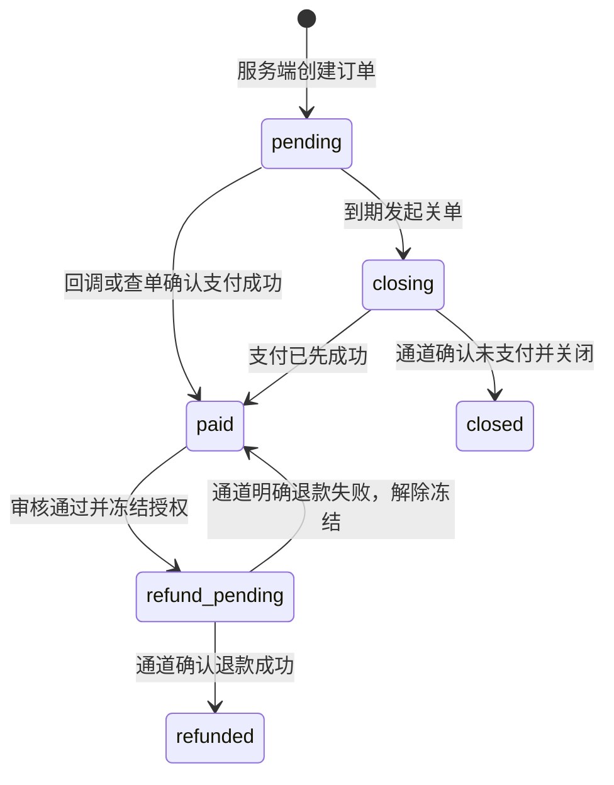

# 账号、赞助、内容与后台运营规格

## 1. 已确定的收费规则

| 身份 | 价格 | 开局权限 |
| --- | --- | --- |
| 单人玩家（含未登录） | 永久免费 | 无限游玩，对话仅本地，不使用开房次数 |
| 未赞助账号 | 免费 | 每个账号累计可开 10 个多人房间，不按月刷新 |
| 月度赞助 | 6 元 / 月 | 赞助有效期间不限创建多人房间次数 |
| 永久赞助 | 20 元 | 永久不限创建多人房间次数 |
| 受邀朋友 | 免费 | 不检查朋友是否赞助，不消耗朋友的免费机会 |

所有模式都不设单局提问次数上限。创建空房间先预留次数；整房第一次有效 Jev 判定才计一次免费开房。同一房间开始下一题不重复扣次。赞助资格在创建房间时确定，到期不打断已创建房间及其中后续局；创建新房间重新检查。免费机会已用 3 次的账号购买赞助后仍保留 7 次，到期后可继续使用这 7 次。

赞助是产品的收费名称，付费后授予明确游戏权益。订单、退款与账务仍完整实现；实际支付类目按商户审核结果接入。当前没有商户资质，测试版不能用个人收款码截图或前端按钮作为自动确认付款的依据。

首发采用用户主动付款续期；无自动扣款授权。价格为用户明确指定；服务器与模型成本必须在后台可测。永久 20 元收入与持续模型成本需通过真实调用记录评估，发现运营压力时向负责人报告，不擅自对已售赞助权益增加商业次数限制。

## 2. 登录和账号

用户明确要求邮箱验证码与 Google OAuth（谷歌账号授权）同时支持。登录页以邮箱输入为主要入口，Google 按钮为第二入口；登录成功后返回原邀请或购买页面。

采用 Better Auth 的 [Email OTP](https://better-auth.com/docs/plugins/email-otp) 和 [Google 登录](https://better-auth.com/docs/authentication/google)。Google 仅申请身份所需的 openid/email/profile，不申请读取 Gmail 邮件权限。OAuth 回调、state 校验和令牌验证交由成熟认证库，按 [Google 服务端授权说明](https://developers.google.com/identity/protocols/oauth2/web-server) 配置域名与回调。

邮箱验证码默认有效 5 分钟、同邮箱 60 秒内限发一次、每次验证码最多尝试 5 次；发送同时按邮箱、账号和 IP 限速，参数通过真实投递测试调整。邮件服务负责真实投递，发信域名设置相应认证记录；不得把控制台打印验证码当作已接入邮箱。

同一个内部用户 ID 关联不同登录方式。Google 身份使用 provider+subject 唯一识别，不只凭返回的邮箱地址识别。账号绑定必须在已登录会话中重新确认本人身份；Google 返回邮箱与已有账号相同但身份尚未绑定时，引导先用邮箱验证码登录再绑定。不得因字符串相同自动合并已存在的游戏、付款或永久赞助记录。

首发支持为现有账号绑定 Google，解绑前确保邮箱方式仍可登录；涉及更换主邮箱需验证新旧邮箱。已经存在的两个账号不做自动合并，由客服核验后单独处理。不得自动转移“免费 10 次”造成重复领取。

每个新用户只初始化一次免费计数；以用户 ID 唯一约束保证并发注册不重复发放。退出登录不会重置次数；封禁账号不能再次使用旧会话。邮箱账号门槛不能证明一个现实中的人只注册一个账号，首发目标为“每账号 10 次”，配合注册和调用频率控制。

网页会话使用 Secure、HttpOnly、SameSite Cookie；写接口验证可信来源与认证库提供的请求保护。服务端每次操作检查停用状态，踢出用户的实时连接。管理账号增加二次认证并独立配置角色。

Google 授权和邮件都需在目标服务器及目标用户网络做真实端到端验证。其一失败要明确展示当前登录错误，不把另一方式偷偷绑定成新账号。

## 3. 月度与永久有效期

- 首次月度赞助从支付核验成功的生效时刻开始，持续一个自然月；时间以 Asia/Shanghai 计算后存为 UTC。
- 记录首次生效的日和时分秒作为锚点；下一月没有对应日时取该月最后一天。例如 1 月 31 日开始，下一边界为 2 月最后一天，再下一边界恢复为 3 月 31 日。
- 在有效期内续期，新的一个月从已有最后到期日延后；已过期后购买，从本次支付生效时刻重新起算。每笔订单各自生成一个独立月度授权区间，可明确退款影响范围。
- 永久赞助成功后生成无到期日的授权。已有月度赞助可支付完整 20 元开通永久，首发不做差价折抵；购买前展示已有月度剩余时间以及此次完整价格。
- 已有永久授权的账号不再显示重复购买按钮；服务端也拒绝新建同类购买订单。若已在途订单并发完成造成重复永久购买，登记为重复购买待退款，不能静默吞掉款项。
- 商品名、金额和授权类型在创建订单时冻结；之后后台修改商品不影响旧订单和已授予权益。
- 永久授权不代表账号不受内容治理和封禁规则约束。账号异常处置与钱款处理分别留痕。

后续如果退款使某个预付区间失效，保留其他已购买区间的原起止时间，不自动移动它们；前端准确展示可能出现的中断日期，客服可以有审计地补偿时长。

## 4. 免费次数与开房事务

赞助资格与免费次数是两种多人开房授权来源。单人接口不加载、不修改开房账户。

`free_room_accounts` 保存用户 total=10、consumed、reserved；`room_entitlements` 保存房间、创建者、来源 sponsorship/free/test、赞助授权 ID、状态。`room_credit_ledger` 追加记录预留、消费、释放、退回，`(room_id, action)` 唯一。

创建房间事务：锁用户赞助账户及免费开房账户 → 检查当前赞助授权 → 有授权则记录 sponsorship 来源；无授权则验证 `10-consumed-reserved > 0` 并预留一个免费机会 → 创建房间、成员、开房授权和事件并提交。已有自己创建的未关闭房间时返回该房间入口；服务端禁止一个用户重复占用多个空房预留。

开始一局只固定题目和主持配置，不再检查新的赞助周期、不重复预留次数。整个房间第一次有效判题事务：若来源 free 且状态 reserved，reserved 减一、consumed 加一并写唯一消费流水。后续问题和新局均不改开房计数。

尚未出现有效判题就关闭房间，释放预留；有效判题后主动放弃或揭晓不退免费次数。若平台故障关闭且房间尚无正常结束的局，已消费的机会自动退回一次；已有正常结束局则转客服处理。详细触发条件见房间协议。关闭、退款和重复任务都不得使计数出现负值。

退款与创建房间需锁定同一个用户授权账户。已经创建的房间保留创建时授权，退款冻结和赞助到期只影响后续新房间；账号封禁和违规内容处置仍能立即关闭房间。转让房主不改变原创建者的开房账本。

## 5. 支付通道与状态机

大陆浏览器优先接入微信支付。桌面选择 Native 扫码，手机外部浏览器需要可用的 H5 支付，微信内网页需要相应 JSAPI 支付能力；具体能开通哪些场景取决于商户与关联应用审核。Native 是通过二维码让用户扫码支付的产品，不能仅凭实现桌面二维码就宣称已完成手机支付。[微信支付 Native 产品说明](https://pay.wechatpay.cn/doc/v3/merchant/4012791874)。

首发的手机目标场景必须有至少一种真实可用的购买方式，并在产品内清楚呈现。微信内网页的支付授权获取 openid 只服务支付，不能自动替换邮箱账号身份。支付宝可在确有需要时新增同一支付适配接口。

支付适配器包括 createOrder（下单）、queryOrder（查单）、closeOrder（关闭）、verifyNotification（验签）、refund（退款）、queryRefund（查退款）。采用官方协议和维护活跃的 SDK；不得自行设计加密或签名规则。实施时复核商户类型、接口版本及平台公钥/证书更新方式。

支付结果处理：

1. 读取原始通知体验签并按通道要求解密；检查商户、应用、商户单号、交易号、金额和币种。
2. 锁定订单和用户授权账户，确保已核实付款状态；重复通知返回原处理结果。
3. 同一数据库事务保存支付交易、订单 paid 状态、月度或永久授权、授权流水及审计记录。
4. 事务成功后再向通道确认处理成功。进程崩溃引起重复通知时，通过唯一约束返回已完成状态。
5. 前端通过本人订单查询获得状态，支付页面回跳或 JavaScript 回调不能直接发放权益。

订单默认 15 分钟有效。关单与支付存在竞争，以通道查单确认的最终状态处理；已确认支付不能因本地定时器先运行而丢弃。后台任务主动核对长时间 pending、closing 和 refund_pending 订单；每日按支付通道账单核对订单、收入、退款与权益。

下单请求发生网络超时，保留原商户单号查单，避免生成第二笔订单重复收费。业务事务与外部请求分开，通过订单状态和持久任务恢复。

## 6. 退款与故障补偿

首发提供用户申请、客服查证、财务批准、通道原路退回的流程。支持按单全额退款；不实现自动按天折算、部分退款与升级差价。是否批准、服务使用后如何处理，以正式公示并审核的退款条款为准，不能让开发模型自行编造条款。

退款获批准：在短事务中创建唯一退款编号，冻结该订单授权并记录审计 → 事务外请求通道退款 → 查证成功后将订单 refunded 并撤销该订单授权。通道结果未知时保持 pending 和冻结，使用同一退款编号继续查询。明确失败则解除冻结并告警，保留原赞助有效期。

对月度订单只撤销对应的时间区间；永久订单退款只撤销其永久授权，其他有效月度区间仍可生效。原有免费 10 次计数不随退款重置。未来尚未生效的月度区间退款不影响已经购买的其他区间。

客服补偿用独立记录：延长月度时长或恢复受故障影响的免费开房。每条补偿引用明确 incidentId（事故编号）或 roomId；免费次数只可恢复该房间原有消费且与自动退回共用唯一动作键，不能突破每账号 10 次总量。后台不允许无记录直接改计数和到期时间。

## 7. UGC 与题库运营

稿件流程：draft（草稿）→ submitted（提交）→ checking（自动检查）→ pending_review（待人工审核）→ published（发布）或 changes_requested（退回修改）；已发布版本可下架。作者修改产生新草稿，旧的线上版本保持可用，直到新版本批准。

机器检查：字段、长度、提示数量、明显重复、内容分类和 Jev 测试结果。机器失败停在可重试状态，不把接口失败当作拒稿。人工检查：汤面真实、不靠歧义作弊、因果完整、提示递进、难度适当、授权可追溯、模型关键事实判定可靠。作者私人试题对话只存浏览器；提交审核的标准用例属于作品材料，提交时明确说明其会保存。

审核员按版本批准；作者提交新版本后，对旧版本的迟到审核不能发布新内容。公开发布在同一事务中设置发布指针和审计记录。来源不明、授权待核实的内容不得进入首发商业可玩题库。

普通编辑下架只影响新开局，正在进行的局可用固定版本完成。严重内容问题或授权要求立即撤下时，运营选择“立即停止相关局”，系统终止相关房间、限制后续历史读取、按系统中止规则处理免费机会并记录原因。

对话、昵称、投稿和举报是不同治理对象。首发支持举报、房主踢人、管理员禁言/停用、内容下架；公开内容审核策略单独配置版本，旧有“色情/政治二选一”规则只能作为历史参考，不能承担完整质量和版权审核。

## 8. 管理后台

| 页面 | 必须能完成的工作 | 权限 |
| --- | --- | --- |
| 运营总览 | 活跃房间、有效组局、赞助收入、Jev 成本、失败率 | 运营只读 |
| 题库 | 搜索、版本比较、来源/授权、发布、下架、受影响房间 | 内容审核 |
| 投稿审核 | 自动检查结果、试题记录、退回理由、人工批准 | 内容审核 |
| 用户 | 身份方式、账号状态、免费计数、赞助授权、封禁记录 | 客服查询；停用需管理权限 |
| 房间调查 | 多人时间线、问题与结果、故障、结束原因、强制停止；无单人查询入口 | 专项调查权限 |
| Jev 运行 | 调用耗时、错误、成本、提示词配置、评测报告 | 模型运维 |
| 赞助与订单 | 通道状态、600/2000 分金额、授权、查单与退款 | 财务 |
| 举报与补偿 | 处置进度、事故关联、恢复免费次数、延长月度时长 | 对应操作权限 |
| 审计 | 操作者、对象、理由、前后变化、关联请求 | 管理员只读 |

角色最小集合：admin（系统管理）、moderator（内容审核）、support（客服）、finance（财务）。一个运营人员可有多个角色；每项权限后端校验。客服查看手机号/邮箱等身份信息时脱敏，查看房间内容要求输入调查理由。

管理端使用公开的服务接口，不直连数据库。审核、退款、封禁、强制结束和补偿必须要求明确原因并显示影响范围；禁止一个“编辑 JSON”入口绕过业务状态约束。

## 9. 成本与定价观察

月度收入 = 6 元 × 月度订单数；永久收入 = 20 元 × 永久订单数。后台分别展示两类人群活跃天数、开局数、有效判题数、模型总成本和退款，不把永久收入当作每月经常性收入。

多人单局模型成本 = 该局全部真实尝试成本之和，包含失败重试；单人只保留按日和模型汇总的成本，不保留逐局或逐人明细。供应商未提供实际用量时显示“成本待核实”，不得记为零。题库审核、多人和单人分别计成本。售价已经确定，本期不自动调价或增加赞助商业次数限制。
