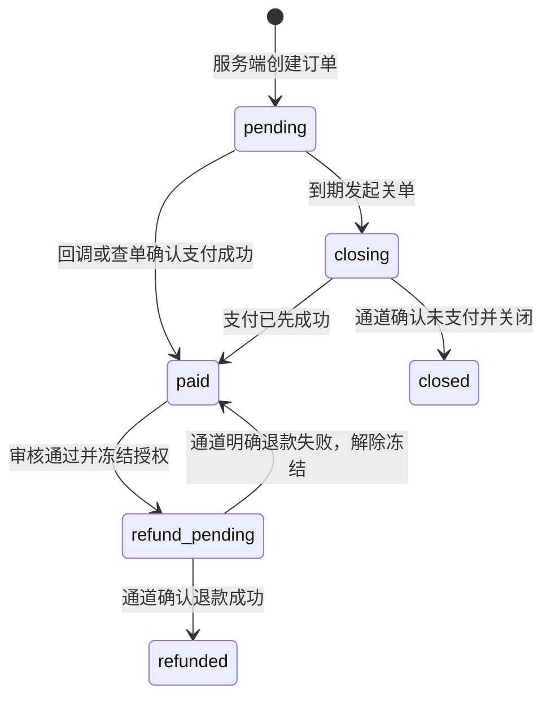

# 账号、赞助、内容与后台运营规格

## 1. 已确定的收费规则

| 身份 | 价格 | 开局权限 |
| --- | --- | --- |
| 单人玩家（含未登录） | 永久免费 | 无限游玩，对话仅本地，不使用开房次数 |
| 未赞助账号 | 免费 | 每个账号累计可开 10 个多人房间，不按月刷新 |
| 月度赞助 | 6 元 / 月 | 赞助有效期间不限创建多人房间次数 |
| 永久赞助 | 20 元 | 永久不限创建多人房间次数 |
| 受邀朋友 | 免费 | 不检查朋友是否赞助，不消耗朋友的免费机会 |

所有模式都不设单局提问次数上限。创建空房间先预留次数；本房第一次有效 Jev 判定才计一次免费开房。一个房间只玩一道题；下一题创建新房间并重新检查资格。赞助到期不打断已创建房间的当前题。免费机会已用 3 次的账号购买赞助后仍保留 7 次，到期后可继续使用这 7 次。

赞助是产品的收费名称，付费后授予明确游戏权益。订单、退款与账务仍完整实现；实际支付类目按商户审核结果接入。当前没有商户资质，测试版不能用个人收款码截图或前端按钮作为自动确认付款的依据。

首发采用用户主动付款续期；无自动扣款授权。价格为用户明确指定；服务器与模型成本必须在后台可测。永久 20 元收入与持续模型成本需通过真实调用记录评估，发现运营压力时向负责人报告，不擅自对已售赞助权益增加商业次数限制。

## 2. 登录和账号

登录支持四种方式：邮箱验证码、邮箱+密码、Google OAuth（谷歌账号授权）与 LINUX DO OAuth。登录页以邮箱输入为主要入口，密码与验证码两个标签页切换，Google 与 LINUX DO 按钮为第三方入口；登录成功后返回原邀请或购买页面。

采用 Better Auth 的邮箱/密码（emailAndPassword）、[Email OTP](https://better-auth.com/docs/plugins/email-otp)、[Google 登录](https://better-auth.com/docs/authentication/google) 和 [通用 OAuth 插件](https://better-auth.com/docs/plugins/generic-oauth)（承载 LINUX DO）。Google 仅申请身份所需的 openid/email/profile，不申请读取 Gmail 邮件权限。OAuth 回调、state 校验和令牌验证交由成熟认证库，按 [Google 服务端授权说明](https://developers.google.com/identity/protocols/oauth2/web-server) 配置域名与回调。

邮箱验证码默认有效 5 分钟。登录与注册共用发送额度：同一邮箱 60 秒内最多发送一次，同一 IP 最近 60 分钟合计最多发送三次，采用滚动窗口。发送额度存入 PostgreSQL，按邮箱和 IP 加事务锁后预占；服务重启不重置。邮件服务接受后保留计数，明确未接受时退回，发送结果未知时保留。被拒绝的请求不生成新验证码、不投递邮件、不增加次数、不延长等待。

超限返回 HTTP 429（请求过于频繁），JSON 包含 `code: OTP_SEND_RATE_LIMITED`（验证码发送超限）、`retryAfterSeconds`（剩余等待秒数）、`limitScope`（邮箱或 IP），同时设置 `Retry-After` 响应头。页面发送中禁止重复点击，成功后等待 60 秒；被限流时按服务器返回时间等待。倒计时保存截止时间，刷新和登录/注册切换后继续；等待期间仍可输入已有验证码。每小时三次按同一公网 IP 合计，因此同一 Wi-Fi 下的用户通常共用额度。

IP 只从配置的可信代理链读取。API 的 `TRUSTED_PROXY_CIDRS`（可信代理地址段）留空时使用直接连接地址；Compose 默认信任 Docker 私有代理网段。宿主 Nginx 需使用 `proxy_set_header X-Forwarded-For $remote_addr;` 写入真实来源，容器 nginx 还原地址后向 API 传递。API 覆盖内部地址头；代理未提供真实客户端地址时返回明确配置错误。采用其它容器网段或额外代理层时同步配置可信地址。邮件服务负责真实投递，发信域名设置相应认证记录。

等待时间向上取整为秒；达到一分钟时，提示向上取整为分钟。例如「发送过于频繁，请在 42 秒后重试。」或「发送过于频繁，请在 28 分钟后重试。」邮箱和 IP 同时受限时返回较长的等待时间。10:20 预占的 IP 额度在 11:20 释放，受限请求不会改变这个时刻。

上线前执行 `pnpm db:migrate`，追加迁移 `0003_otp_send_quota.sql` 创建验证码发送额度表。维护任务清理超过一天的记录；额度判定只读取最近一小时的有效记录，清理时间不影响等待时间。发送成功返回 `success: true`（发送成功）和 `retryAfterSeconds: 60`（等待 60 秒）；明确发送失败返回等待零秒，发送结果未知时返回等待 60 秒。

忘记密码：登录页密码区提供找回密码入口。Better Auth 签发一次性重置 token（1 小时有效），服务端拼成站内 `/reset-password?token=…` 链接交由邮件通道发送；重置页校验两次输入一致后设置新密码，成功后跳回登录页提示使用新密码。邮箱不存在时申请接口同样返回成功，页面只展示统一的「已发送」提示，防账号枚举。无需额外数据库字段，密码凭据由认证库的 account 表保存。

LINUX DO（connect.linux.do）走授权码模式：授权跳转由用户浏览器直连，token 兑换用 HTTP Basic 头携带凭据、不使用 PKCE，用户信息取 `/api/user`（Discourse 风格接口）。该接口不返回邮箱，以 `linuxdo-<用户id>@linuxdo.invalid` 占位邮箱建号（`.invalid` 为保留的不可用顶级域，不会与真实邮箱冲突）；展示名优先 LINUX DO 昵称、退回用户名，头像为带 `{size}` 占位的模板路径，服务端补全为 288px 绝对地址。应用回调统一为 `https://<域名>/api/v1/auth/callback/linuxdo`。境内服务器复用 Google 的同一出站中继转发 token 与 userinfo 请求，授权跳转仍由浏览器直连。

同一个内部用户 ID 关联不同登录方式。Google 身份使用 provider+subject 唯一识别，不只凭返回的邮箱地址识别。账号绑定必须在已登录会话中重新确认本人身份；Google 返回邮箱与已有账号相同但身份尚未绑定时，引导先用邮箱验证码登录再绑定。不得因字符串相同自动合并已存在的游戏、付款或永久赞助记录。

首发支持为现有账号绑定 Google，解绑前确保邮箱方式仍可登录；涉及更换主邮箱需验证新旧邮箱。已经存在的两个账号不做自动合并，由客服核验后单独处理。不得自动转移“免费 10 次”造成重复领取。

每个新用户只初始化一次免费计数；以用户 ID 唯一约束保证并发注册不重复发放。退出登录不会重置次数；封禁账号不能再次使用旧会话。邮箱账号门槛不能证明一个现实中的人只注册一个账号，首发目标为“每账号 10 次”，配合注册和调用频率控制。

昵称允许与其他玩家重名，仅约束 1～30 个字符（去首尾空格）。注册未填写时默认「用户+6 位随机编号」，不使用邮箱前缀，避免在房间内暴露邮箱；玩家可在「我的」页面随时修改，修改即生效并同步到后续房间展示。

网页会话使用 Secure、HttpOnly、SameSite Cookie；写接口验证可信来源与认证库提供的请求保护。服务端每次操作检查停用状态，踢出用户的实时连接。管理账号增加二次认证并独立配置角色。

Google、LINUX DO 授权和邮件都需在目标服务器及目标用户网络做真实端到端验证。其一失败要明确展示当前登录错误，不把另一方式偷偷绑定成新账号。

## 3. 月度与永久有效期

- 首次月度赞助从支付核验成功的生效时刻开始，持续一个自然月；时间以 Asia/Shanghai 计算后存为 UTC。
- 记录首次生效的日和时分秒作为锚点；下一月没有对应日时取该月最后一天。例如 1 月 31 日开始，下一边界为 2 月最后一天，再下一边界恢复为 3 月 31 日。
- 在有效期内续期，新的一个月从已有最后到期日延后；已过期后购买，从本次支付生效时刻重新起算。每笔订单各自生成一个独立月度授权区间，可明确退款影响范围。
- 永久赞助成功后生成无到期日的授权。已有月度赞助可支付完整 20 元开通永久，首发不做差价折抵；购买前展示已有月度剩余时间以及此次完整价格。
- 已有永久授权的账号不再显示重复购买按钮；服务端也拒绝新建同类购买订单。若已在途订单并发完成造成重复永久购买，登记为重复购买待退款，不能静默吞掉款项。
- 商品名、金额和授权类型在创建订单时冻结；之后后台修改商品不影响旧订单和已授予权益。
- 永久授权不代表账号不受内容治理和封禁规则约束。账号异常处置与钱款处理分别留痕。

后续如果退款使某个预付区间失效，保留其他已购买区间的原起止时间，不自动移动它们；前端准确展示可能出现的中断日期，客服可以有审计地补偿时长。

## 4. 免费次数与开房事务

赞助资格与免费次数是两种多人开房授权来源。单人接口不加载、不修改开房账户。

`free_room_accounts` 保存用户 total=10、consumed、reserved；`room_entitlements` 保存房间、创建者、来源 sponsorship/free/test、赞助授权 ID、状态。`room_credit_ledger` 追加记录预留、消费、释放、退回，`(room_id, action)` 唯一。

创建房间事务：锁用户赞助账户及免费开房账户 → 检查当前赞助授权 → 有授权则记录 sponsorship 来源；无授权则验证 `10-consumed-reserved > 0` 并预留一个免费机会 → 创建房间、成员、开房授权和事件并提交。每次成功创建都会产生独立房间及授权；用户可同时持有多个房间。空房预留分别占用免费余量，避免并发创建超额。

本房开局只固定一道题和主持配置，不再检查新的赞助周期、不重复预留次数。第一次有效判题事务：若来源 free 且状态 reserved，reserved 减一、consumed 加一并写唯一消费流水。后续问题不改本房计数；下一题创建独立新房并单独授权。

尚未出现有效判题就主动取消房间，释放预留；有效判题后主动放弃或揭晓不退免费次数。离线与闲置不关闭房间、不释放预留。若运营因平台故障确认终止，且房间尚未正常结束，已消费的机会按事故规则退回一次。详细触发条件见房间协议。终止、退款和重复任务都不得使计数出现负值。

退款与创建房间需锁定同一个用户授权账户。已经创建的房间保留创建时授权，退款冻结和赞助到期只影响后续新房间；账号封禁和违规内容处置仍能立即关闭房间。转让房主不改变原创建者的开房账本。

## 5. 支付通道与状态机

大陆浏览器优先接入微信支付。桌面选择 Native 扫码，手机外部浏览器需要可用的 H5 支付，微信内网页需要相应 JSAPI 支付能力；具体能开通哪些场景取决于商户与关联应用审核。Native 是通过二维码让用户扫码支付的产品，不能仅凭实现桌面二维码就宣称已完成手机支付。[微信支付 Native 产品说明](https://pay.wechatpay.cn/doc/v3/merchant/4012791874)。

首发的手机目标场景必须有至少一种真实可用的购买方式，并在产品内清楚呈现。微信内网页的支付授权获取 openid 只服务支付，不能自动替换邮箱账号身份。支付宝可在确有需要时新增同一支付适配接口。

支付适配器包括 createOrder（下单）、queryOrder（查单）、closeOrder（关闭）、verifyNotification（验签）、refund（退款）、queryRefund（查退款）。采用官方协议和维护活跃的 SDK；不得自行设计加密或签名规则。实施时复核商户类型、接口版本及平台公钥/证书更新方式。

```mermaid
stateDiagram-v2
    [*] --> pending: 服务端创建订单
    pending --> paid: 回调或查单确认支付成功
    pending --> closing: 到期发起关单
    closing --> closed: 通道确认未支付并关闭
    closing --> paid: 支付已先成功
    paid --> refund_pending: 审核通过并冻结授权
    refund_pending --> refunded: 通道确认退款成功
    refund_pending --> paid: 通道明确退款失败，解除冻结
```

支付结果处理：

1. 读取原始通知体验签并按通道要求解密；检查商户、应用、商户单号、交易号、金额和币种。
2. 锁定订单和用户授权账户，确保已核实付款状态；重复通知返回原处理结果。
3. 同一数据库事务保存支付交易、订单 paid 状态、月度或永久授权、授权流水及审计记录。
4. 事务成功后再向通道确认处理成功。进程崩溃引起重复通知时，通过唯一约束返回已完成状态。
5. 前端通过本人订单查询获得状态，支付页面回跳或 JavaScript 回调不能直接发放权益。

订单默认 15 分钟有效。关单与支付存在竞争，以通道查单确认的最终状态处理；已确认支付不能因本地定时器先运行而丢弃。后台任务主动核对长时间 pending、closing 和 refund_pending 订单；每日按支付通道账单核对订单、收入、退款与权益。

下单请求发生网络超时，保留原商户单号查单，避免生成第二笔订单重复收费。业务事务与外部请求分开，通过订单状态和持久任务恢复。

## 6. 退款与故障补偿

首发提供用户申请、客服查证、财务批准、通道原路退回的流程。支持按单全额退款；不实现自动按天折算、部分退款与升级差价。是否批准、服务使用后如何处理，以正式公示并审核的退款条款为准，不能让开发模型自行编造条款。

退款获批准：在短事务中创建唯一退款编号，冻结该订单授权并记录审计 → 事务外请求通道退款 → 查证成功后将订单 refunded 并撤销该订单授权。通道结果未知时保持 pending 和冻结，使用同一退款编号继续查询。明确失败则解除冻结并告警，保留原赞助有效期。

对月度订单只撤销对应的时间区间；永久订单退款只撤销其永久授权，其他有效月度区间仍可生效。原有免费 10 次计数不随退款重置。未来尚未生效的月度区间退款不影响已经购买的其他区间。

客服补偿用独立记录：延长月度时长或恢复受故障影响的免费开房。每条补偿引用明确 incidentId（事故编号）或 roomId；免费次数只可恢复该房间原有消费且与自动退回共用唯一动作键，不能突破每账号 10 次总量。后台不允许无记录直接改计数和到期时间。

## 7. UGC 与题库运营

自带题与投稿题统一统计赞数、踩数和净支持量，题库支持按净支持量排序；作者在“我的作品”查看反馈。投票按账号与作品唯一，不要求提供游玩记录。作品署名由作者选择：匿名立即隐藏公开身份，新增或修改公开署名经过审核；自带题保留实际授权要求的署名。详细规则与接口见 [题目点赞与作者署名](11-VOTES-AND-AUTHORSHIP.md)。运营不能直接编辑真实投票总数。

用户稿件流程：draft（草稿）→ submitted（提交）→ checking（Jev 初审）。初审通过直接 published（发布），初审拒绝进入 changes_requested（退回修改），无法确定进入 pending_review（待后台复核）。调用失败恢复可重试状态，记录失败原因，由持久任务最多重试三次。管理员通过后审复核、退回或下架处理内容。

创作中心入口位于首页和“我的”。草稿只要求标题；投稿需标题、汤面、汤底、三条提示、语言、难度和题目来源。来源分“自制 / 转载”：自制无需补充来源，转载必须填写有效的 HTTP 或 HTTPS 原作者链接。页面不要求协议勾选、授权声明、核心事实、因果链或标准问答用例。署名与匿名选项沿用现有规则。

保存、提交、撤回和复制新稿携带版本编号及更新时间，旧页面覆盖返回状态冲突。提交后的正文固定，修改产生新草稿；新版初审通过后切换公开指针，旧版本在此之前保持可用。作者可撤回提交、自动检查或人工待审阶段，原稿保留并复制新草稿；迟到的 Jev 结果不会重新发布已撤回版本。

Jev 初审沿用 main 分支的内容判断，检查标题、汤面、汤底及提示中的色情或政治内容。只有明确通过才自动发布，判定不确定保留给后台复核。状态、公开指针与自动发布审计在同一事务完成。初审无法验证作品版权或完整游玩质量，这些由后台后审结合来源链接处理。

后台详情展示题目来源、原作者链接、同版语言内容和初审/人工审核记录。用户投稿不经过独立授权审批门槛；平台自带及导入题库继续按原授权流程审核。已下架作品的新稿通过初审后仍保留停用标记，后台明确批准后恢复公开，自动任务不会绕过下架。私人试题使用已保存内容摘要，修改后旧凭证失效；对话只存浏览器。

同版多语言审核以作品编号和版号确定范围：

| 操作 | 行为与条件 |
| --- | --- |
| 审核列表 | 每个作品最新版号的各语言分别显示，列出语言、版号、审核状态和停用状态 |
| 审核详情 | 展示当前语言记录与同版全部语言的标题、汤面、汤底和提示 |
| 批准当前语言 | 仅批准当前待人工审核语言；其它语言保留各自状态 |
| 批准同版全部语言 | 审核员查阅同版各语言内容并填写理由；全部语言须处于待人工审核或已发布状态，且至少一条待人工审核；用户投稿可直接复核，平台自带及导入题库须授权已批准 |
| 已发布作品补发语言 | 可从同版任一语言详情执行批量批准；已发布语言保持发布状态，待审核语言被批准，同版发布指针保持原值 |
| 发布审计 | 每个本次新发布的语言分别保存审批对象、理由、批准范围、版号、语言与发布状态；随发布操作一起提交 |

审核接口 `POST /admin/puzzle-versions/:id/approve` 接收 `reason`（2～500 字的理由）和 `scope`（批准范围）。`scope: "language"` 表示当前语言，省略时也使用当前语言；`scope: "revision"` 表示同一作品、同一版号的全部语言。成功返回作品编号与所选范围内的已发布语言清单。平台自带或导入题库授权未通过、所选范围含不可批准状态、或所选语言已全部发布且未被停用时，返回 `STATE_CONFLICT`（状态冲突），本次操作不写入发布变更。

用户投稿由 Jev 初审通过后自动发布，平台自带及导入题库通过后台审核发布。已有中文已发布、英文待审核的作品，可在详情核对英文内容后选择“批准当前语言”或“批准同版全部语言”。本地种子脚本的 `--publish`（发布开发题库）用于开发环境；普通部署不会自动运行种子服务，也不会自动批准待审翻译。

普通编辑下架只影响新开局，正在进行的局可用固定版本完成。严重内容问题或授权要求立即撤下时，运营选择“立即停止相关局”，系统终止相关房间、限制后续历史读取、按系统中止规则处理免费机会并记录原因。

对话、昵称、投稿和举报是不同治理对象。首发支持举报、房主踢人、管理员禁言/停用、内容下架；Jev 初审检查色情或政治内容，后台后审处理质量、版权和举报，并保存操作理由。

## 8. 管理后台

| 页面 | 必须能完成的工作 | 权限 |
| --- | --- | --- |
| 运营总览 | 活跃房间、有效组局、赞助收入、Jev 成本、失败率 | 运营只读 |
| 题库 | 搜索、版本比较、同版多语言内容、来源/授权、当前语言或同版全部语言发布、下架、受影响房间 | 内容审核 |
| 投稿审核 | Jev 初审记录、原作者链接、复核理由、人工批准或下架 | 内容审核 |
| 用户 | 身份方式、账号状态、免费计数、赞助授权、封禁记录 | 客服查询；停用需管理权限 |
| 房间调查 | 多人时间线、问题与结果、故障、结束原因、强制停止；无单人查询入口 | 专项调查权限 |
| Jev 运行 | 调用耗时、错误、成本、提示词配置、评测报告 | 模型运维 |
| 赞助与订单 | 通道状态、600/2000 分金额、授权、查单与退款 | 财务 |
| 举报与补偿 | 处置进度、事故关联、恢复免费次数、延长月度时长 | 对应操作权限 |
| 审计 | 操作者、对象、理由、前后变化、关联请求 | 管理员只读 |

角色最小集合：admin（系统管理）、moderator（内容审核）、support（客服）、finance（财务）。一个运营人员可有多个角色；每项权限后端校验。客服查看手机号/邮箱等身份信息时脱敏，查看房间内容要求输入调查理由。

管理端使用公开的服务接口，不直连数据库。审核、退款、封禁、强制结束和补偿必须要求明确原因并显示影响范围；禁止一个“编辑 JSON”入口绕过业务状态约束。

## 9. 成本与定价观察

月度收入 = 6 元 × 月度订单数；永久收入 = 20 元 × 永久订单数。后台分别展示两类人群活跃天数、开局数、有效判题数、模型总成本和退款，不把永久收入当作每月经常性收入。

多人单局模型成本 = 该局全部真实尝试成本之和，包含失败重试；单人只保留按日和模型汇总的成本，不保留逐局或逐人明细。供应商未提供实际用量时显示“成本待核实”，不得记为零。题库审核、多人和单人分别计成本。售价已经确定，本期不自动调价或增加赞助商业次数限制。
