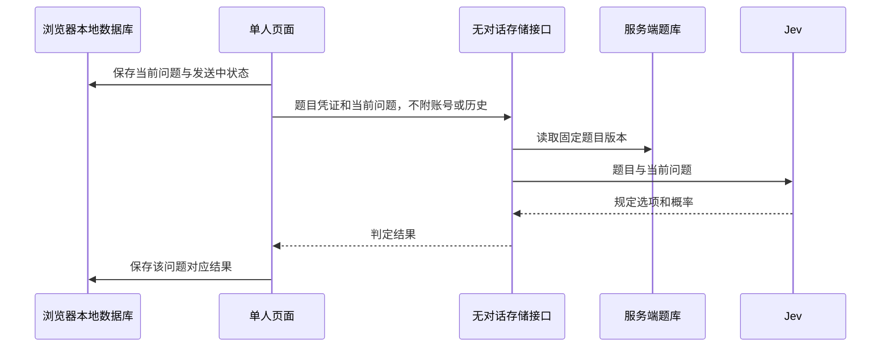

# 单人模式与本地记录规格

## 1. 产品规则

所有用户都能永久、无限地单人游玩，无需登录和赞助。不消耗多人开房的 10 次免费机会。登录用户进入单人模式也遵循相同规则。

单人问题、回答、还原尝试、提示进度和已玩记录保存在当前浏览器；本平台服务端不保存单人对话或关联个人的游玩明细。服务器仍需接收当前问题，读取题库并调用 Jev，得到结果后立即返回。

本地保存不等于离线 AI。没有网络时可以阅读已有记录和编辑草稿，重新连接后才能提交新的判断。服务端不持有单人记录，因此不能提供找回或跨设备同步。

## 2. 与多人模式共享和分离的部分

| 共用 | 单人独立 | 多人独立 |
| --- | --- | --- |
| 题目版本、判题提示词、结果枚举、Jev 适配器 | IndexedDB 存储、匿名请求、本地交互状态 | 成员、事件、队列、数据库记录、开房权限 |
| 问答卡片、提示卡、还原输入、翻译文案 | 无云端对话、不上传账号游玩关联 | 服务器分配顺序并广播 |
| 题库来源、授权和质量标准 | 用户自己决定揭晓提示和答案 | 房主操作改变所有成员状态 |

单人不能通过多人创建接口实现；否则会留下服务器对话和消费路径。两种模式分别提供 `SoloSessionController`（单人页面控制器）和 `RoomSessionController`（多人页面控制器），共用纯展示组件，避免一个复杂组件到处判断模式。

## 3. 单人 HTTP 契约

普通单人请求使用 `credentials: omit`（不携带账号 Cookie），不加载账号认证中间件。服务端仍忽略主动附带的 Cookie/Authorization，不将其写日志。接口只接受允许的字段，多余历史、身份或客户端答案字段直接拒绝。

| 路径 | 请求 | 返回 |
| --- | --- | --- |
| `POST /api/v1/solo/sessions` | puzzleId、language，可带恢复所需的 versionId | 公开汤面、固定版本、无状态签名凭证 |
| `POST /api/v1/solo/judge` | 凭证、当前 question（最多 500 字） | yes/no/irrelevant/uncertain |
| `POST /api/v1/solo/solve` | 凭证、当前 solution（最多 1,500 字） | solved/close/not_yet/uncertain；成功时含汤底 |
| `POST /api/v1/solo/hints` | 凭证、提示序号 | 对应提示 |
| `POST /api/v1/solo/reveal` | 凭证、confirmed=true | 固定版本汤底 |

凭证采用成熟 `jose` 库的签名令牌，仅含用途 solo、题目版本、语言、主持配置版本、生效/到期时间；不含用户、设备、汤底、问题或唯一访问追踪 ID。有效期默认 24 小时，过期可按原版本重新获取，不限制游戏时间。所有端点都核对题目未被紧急停用；普通更新后的旧版本可继续玩，历史版本不自动删除。

凭证只保证版本和输入用途合法，不承担单人作弊控制。提示状态由浏览器掌握；用户选择揭晓即可取得答案。普通匿名凭证只允许已公开且授权可用的题目，不能填写任意草稿版本绕过作者权限。

作者试题先在认证接口校验作品归属，签发用途 solo_preview 的短期凭证，之后判题请求不携带账号。凭证绑定不可变的试题内容快照版本，界面修改后要重新保存和签发。试题内容属于作者明确保存的作品；试题问题和回答不持久化。

## 4. 浏览器存储

使用 [idb](https://github.com/jakearchibald/idb) 封装 IndexedDB，以便保存长对话并按局分页。`localStorage` 仅存主题、语言等小型偏好。浏览器数据受同源、容量和清理策略影响，实现应处理实际存储失败。[浏览器存储说明](https://developer.mozilla.org/en-US/docs/Web/API/Storage_API/Storage_quotas_and_eviction_criteria)。

| 本地表 | 字段 |
| --- | --- |
| `solo_sessions` | localSessionId、puzzleId、versionId、language、公开汤面、开始时间、状态、已解锁提示、已揭晓答案 |
| `solo_turns` | localTurnId、localSessionId、顺序、ask/solve 类型、文本、sending/succeeded/failed 状态、结果、时间 |
| `solo_progress` | puzzleId、language、已玩/已解开/已揭晓、最近游玩时间、问答数 |
| `solo_drafts` | localSessionId、当前输入模式、尚未发送文本 |
| `local_meta` | 数据结构版本与本地迁移完成标记 |

本地 ID 不发送到服务端。每次发送先写本地 sending 状态，再请求模型；拿到结果用 localTurnId 更新原记录。一个页面同时最多一个请求，重复点击不再发送。页面刷新时遗留 sending 标记转为“上次请求未完成”，由用户明确重试；服务端不保存对话，无法恢复已丢失的响应。

IndexedDB 事务只覆盖本地读写，不能把网络等待放在同一事务里。同一个本地会话多标签页通过 Web Locks（浏览器跨标签页锁）与 BroadcastChannel（标签页通知）协调，避免双重编辑；实施时核对目标浏览器支持，并在不支持的设备明确限制同会话多标签编辑。

支持删除单局、清空全部记录、本地 JSON 导出/导入。导入用标准 JSON 解析和 Zod 结构校验，所有文本按纯文本显示。不得把导入数据视作多人成功记录或赞助资格。导出文件只在浏览器生成，不上传服务器。

存储失败必须显式提示“本地记录未保存”，保留当前页内存内容并提供导出。禁止显示已保存，也不静默上传云端保存。用户决定清理空间或导出后继续。清空动作需二次确认。

## 5. 不保存单人信息的实现范围

- 单人调用不写 `users`、`rooms`、`rounds`、`turns`、`commands`、`room_events`、`jev_calls` 或 pg-boss 任务正文。
- 代理层对 `/solo/*` 关闭包含 IP、Cookie、完整 URL、请求体、响应体的访问明细；应用层关闭该路径的请求追踪明细、错误正文捕获和分析平台会话回放。
- 错误只计入类别、状态码、按模型汇总的计数和时长分布，不附问题、汤底、身份或稳定会话标识。可为当前页面返回临时错误编号，但不建立可追踪个人的服务端链路。
- 当前问题仅在处理所需的内存和上游请求中存在，完成后释放引用；不写缓存、磁盘临时文件或失败队列。
- 防滥用只用短期内存并发和频率控制。IP 如用于短期限速，最长保留 60 秒且不写磁盘、不加入指标标签；原始网络地址不得被分析或审计存储。部署核查基础设施日志设置。
- 单人不上传“我玩过这题”的标记；多人页面可以在本地提示本人已玩，不把本地历史发给房间成员。
- 用户主动投稿、举报或联系客服属于独立明确提交行为；显示将发送的具体内容。普通单人结束不自动上报记录。

Jev 作为外部模型服务会接收题目和当前问题；上线前核实供应商的数据保留选项。页面隐私说明准确区分“本平台不保存单人对话”和“调用模型需要发送当前问题”，不能声称模型从未接触问题或未经核实承诺供应商零保留。

## 6. 并发与故障

单人判题采用直接 HTTP 异步请求，不经过持久任务。一个 API 进程初始允许 2 个并发 Jev 请求；超出即时容量时返回明确的稍后重试状态，浏览器保留输入。并发值根据服务器与真实 Jev 配额调整，不引入每日、每月或终身提问额度。

最多 20 秒单次尝试、额外重试 1 次、总期限 45 秒，复用多人 Jev 适配器的错误分类。调用失败后本地保留问题，用户可重试；重试仍归当前本地问题，但上游可能再次计费。没有服务端持久去重记录，不承诺跨进程崩溃时的恰好一次调用。

单人 API 和多人任务使用独立并发预算，共用总额度规划，避免单人突发流量堵住所有多人房间。保护机制向用户显示排队/繁忙状态，不伪造判断，也不要求赞助才能恢复单人功能。

## 7. 验收证据

用真实浏览器完成未登录游玩、已登录后进入单人、刷新恢复、断网重试、本地删除导出、同题多人同时进行。记录前后免费开房计数相同。

对比真实数据库、队列表、代理日志、应用日志和错误上报，确认没有单人正文和身份明细。真实调用 Jev 并确认只发送当前问题与固定题目内容，未发送历史或账号。该检查与普通功能测试一起作为上线门槛。
