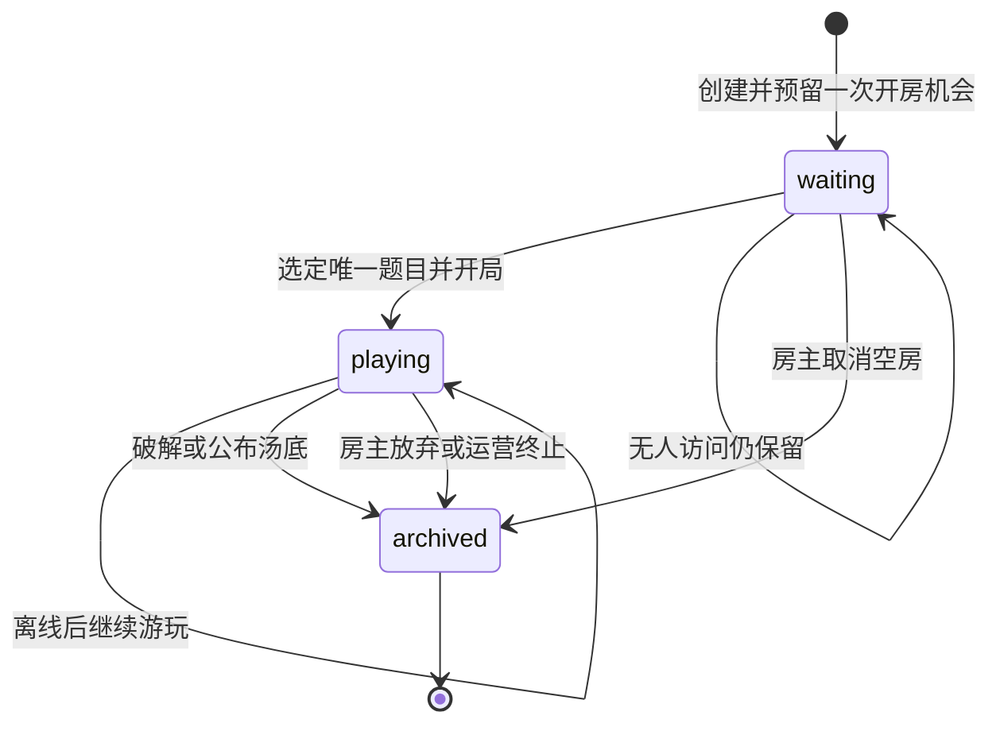

# 房间生命周期修订与实现任务

版本：2026-09-26。本文记录本次确认的新规则；与 01～09 文档有冲突时，以本文为准。实现时应同步修改旧文档和代码，避免留下两套规则。

## 一、已经确认的产品规则

1. **一房一题**。一个房间实体只承载一道海龟汤及其全部提问、讨论、提示、成员和事件。开局后不能在该房间切换题目。破解成功或房主公布汤底时，这个房间进入终态并归档；历史仍可按权限查看，不能再写入游戏内容。
2. **一次新题就是一次新房**。结算页提供“再来一题”：房主选题后，服务端创建新的房间 ID、新的邀请凭证和独立事件序列；旧房记录不复制到新房。每创建一个新房都按创建时的赞助资格或免费余量授权。未赞助用户累计最多消耗 10 次有效开房机会；新房首次有效 Jev 判定才把预留转为消费。空房取消释放预留。
3. **一键迁移人员**。房主从已结束房间发起下一题时，服务端在创建新房的同一事务中把旧房仍有资格的成员加入新房，保留房主身份；被踢和已主动退出的人不迁移。在线成员收到新房入口事件，离线成员回访时可从首页进入新房，无需逐人重新接受邀请。新房仍遵守 8 人上限和一人最多一个进行中房间；若某成员已加入其他房间，迁移应明确显示该成员未迁入，不能影响其他成员或重复计费。新房无法创建时，旧房结算和历史保持可读，不能出现半迁移。
4. **未结束就可续玩**。离线、无人访问、等待过久均不结束或归档房间，也不消耗或释放其预留。房间状态、队列和记录保留；玩家回来后从服务端快照与事件恢复。离线只改变在线状态，不改变房间或题目的生命周期。房主身份不因离线自动转让，转让由房主主动执行。用户主动放弃、解散及运营强制终止属于明确的终止操作，需要保存原因并归档；已产生有效判定的免费机会不退。
5. **当前房间历史对新成员开放**。新加入者能读取该房自创建以来的公开问答与讨论，并取得当前游戏的快照；未揭晓的汤底及未解锁提示仍不可读。房间只有一道题，因此没有跨题历史混入。被踢出、被封禁的成员停止接收实时事件，也不能再通过接口补取或参与。
6. **单人无限游玩**。单人模式不设按人、按题、按 IP 的业务频率限制，也没有每日或总次数额度。服务端仍按真实 Jev 与服务器容量处理并发；容量不足时返回明确的繁忙状态，不把多个玩家合并到同一题目的计数器。单人对话仅存浏览器。
7. **收费顺序**。先完成房间生命周期和免费次数的正确性；真实收款、退款与商户联调仍是收费上线前的独立任务。尚未完成时保持收款入口关闭。

## 二、状态与数据边界

`archived` 表示业务终态与只读历史。数据库可继续使用 `closed` 状态，但所有接口应统一按“已归档、不可写”处理。一个房间至多一局；若保留 `rounds` 表作为已有游戏模型，必须约束一个 roomId 只能创建一个 round，且开局后题目版本不可修改。新房间的事件序号从自身起点开始，旧房的游标不能用于新房。

迁移建议使用独立的“续玩关系”记录：源房、目标房、发起者、成员迁移结果和创建时间。创建新房、锁定旧房合格成员、写入新房成员及迁移关系在同一事务完成；重复请求应返回同一目标房。新房建立后向在线成员推送入口，离线成员登录时从个人房间列表找到它。迁移不复制问答、答案或未解锁内容。

房主有尚未结束的自建房间时，继续返回该房入口；只有房间归档后才能创建下一房。离线房长期存在需要在首页和“我的房间”提供明显的继续入口，以及房主主动放弃入口。离线房不能被定时任务自动关闭，也不能因房主离线自动转让。

## 三、交给实现模型的问题清单

| 编号 | 问题与代码位置 | 应完成的行为与验收 |
| --- | --- | --- |
| R01 | 同房可多局：`apps/api/src/rooms/commands.service.ts` 的 `select_puzzle`、`start_round` 和结算页“下一局” | 已开局房间题目锁定；结算后旧房只读；选新题创建新 roomId。验证旧房与新房的题目、事件、问答和邀请凭证完全分开。 |
| R02 | 新房迁移人员入口缺失：`apps/web/src/rooms/room-page.tsx`、房间接口与数据库 | 房主一键发起，合格成员在同一事务加入新房；在线成员收到入口，离线成员回访可进入；已加入别房的成员明确显示未迁入；重试不会创建多个目标房或重复扣次数；旧房仍可查。 |
| R03 | 免费计数按旧的“同房换题不扣”实现：`apps/api/src/rooms/rooms.service.ts`、`packages/database/src/rooms-tx.ts` | 每个新 roomId 单独预留与消费；首次有效判定只消费一次；无资格时不能发起下一题迁移，旧房不受影响。赞助用户创建新房不限次数。 |
| R04 | `apps/jobs/src/main.ts` 目前在全员离线 30 分钟、等待室闲置 24 小时后关闭房间 | 删除自动关闭、自动结束局与相关自动释放行为。真实离线超过这些时间后重连，房间、题目、问题和预留均保持原状。 |
| R05 | `apps/jobs/src/main.ts` 的模型故障处理可能自动关闭房间；房主离线任务可能自动转让 | 模型故障只让该次任务明确失败并允许后续重试；平台需要强制终止时单列运营操作和原因。房主离线后身份保持不变，支持主动转让。 |
| R06 | `apps/api/src/realtime/realtime.gateway.ts` 只在订阅时检查成员身份 | 踢人、封禁立即停止旧连接订阅；每次补发和发送前复核权限。用真实连接验证被踢者收不到后续事件、不能继续写入、不能用旧序号补取。 |
| R07 | 旧文档要求“加入前不可读”；当前 `eventsAfter` 已允许取本房早期事件，但快照、分页和页面仍需一起核对 | 当前成员可从该房起点读取公开历史，晚加入时展示该题已有全部问答与讨论；汤底、未解锁提示仍受状态控制；被踢者无权读取。 |
| R08 | `apps/api/src/solo/solo.controller.ts` 按题目版本共享 30 次/分钟限制 | 移除单人业务限流及文案；保留服务器与 Jev 并发容量处理。多位匿名玩家同时玩同题时，互不消耗彼此的次数。 |
| R09 | 旧文档和测试断言仍允许同房第二局、离线自动关闭、单人限流 | 更新契约、数据库迁移、前后端、任务流程及真实端到端验收；旧的“同房第二局不扣次”测试改为“新房独立计数、一键迁移”。 |
| R10 | 收费入口与退款仍未形成真实闭环：`apps/api/src/admin/admin.controller.ts`、`apps/api/src/billing` | 本轮可后置；保持收款入口关闭。收费上线前完成真实支付金额校验、退款执行和回调查单验证。 |
| R11 | 现有 `rooms` 可以包含多条 `rounds`，新规则要求一房一题 | 数据迁移前统计已有多局房间；保留其历史可读。新版本禁止继续向这些旧房加局，并明确旧记录的展示方式；迁移不得删除旧问答或错误地把多题归到新房。 |
| R12 | 玩家端缺少原创题目创作入口：`apps/web/src/app.tsx` 只有游玩、房间、个人和登录路由 | 创作者可在玩家端保存草稿、提交审核、看退回理由并修改；后台审核与公开发布状态同步。此项属于原 MVP 尚未完成的功能，可在房间改造后排期。 |

## 四、验收场景

1. 两人开房、提问、离线超过 30 分钟、回到同一房：记录与题目原样恢复，可以继续提问。
2. 等待室超过 24 小时无人访问：房主回访仍能选题和开局；免费机会仍处于预留状态。
3. 新成员在游戏中加入：能看该房所有已公开问题和讨论，看不到汤底及未解锁提示。
4. 踢出一个保持连接的成员：其后续事件立即停止；写接口和补齐接口均拒绝。
5. 破解或公布答案后，旧房归档。房主点击再来一题，生成新 roomId；原房合格成员自动成为新房成员，旧房历史留在旧 roomId。
6. 免费账号已用 9 次：新房首个有效判定后累计为 10；再来一题创建失败时旧房历史仍可读。空房取消只释放本房预留。
7. 两位匿名玩家同时玩同一道单人题：判题不受对方请求数量影响，单人对话不进入服务端业务表。

## 五、实施顺序

先处理 R11 的旧数据统计，再完成 R01、R03 和数据库约束，随后做 R02 的迁移体验；接着处理 R04～R09 并做完整多人实测。R12 是独立的创作中心交付；R10 在准备收费时单独验收。代码改动和人工体验确认后再提交；本文件只定义任务，不声称这些功能已实现。
