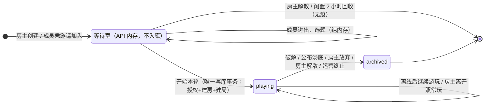

# 房间生命周期修订（v2：等待室与开局时序）

版本：2026-10-01。v1（2026-09-30）确立一房一题与多房间规则并已实现；v2 把「开房组队」阶段改为内存等待室，数据库只从「开始本轮」起记录。本文是唯一有效规则源；实现与本文冲突时以本文为准，v1 的任务清单与验收记录见 git 历史。

## 一、产品规则

1. **一房一题**。一个房间实体只承载一道海龟汤及其全部提问、讨论、提示、成员和事件。破解成功或房主公布汤底时房间进入终态并归档；历史仍可按权限查看，不能再写入游戏内容。
2. **等待室不入库**。开房间的组队阶段（等待室）只存在于 API 进程内存：创建、加入、踢人、选题都不写数据库。点击「开始本轮」才在单个数据库事务里完成授权预留 → 建房间 → 建局 → 事件落库，房间生命从这一刻开始。解散未开始的等待室 = 删除内存对象：零数据库操作、零计费、零痕迹。
3. **先选题后开始**。房主必须先选定一道已发布题（记在内存等待室，成员可见题目名），「开始本局」按钮才可用。开局事务内重新校验题目仍为已发布，防止选题后题目被下架。
4. **等待室解散路径唯一**：房主点「解散」。房主返回上一页、关页、掉线均保留等待室；非房主成员可自由离开并可再凭邀请加入。整个等待室连续 2 小时无任何成员心跳，自动回收（无痕解散）。
5. **房主等待室单例**。同一用户作为房主同时只能有一个未开局的等待室；再次点「开房间」进入的是同一个等待室（同批成员、已选题保留）。开局成功或等待室回收后名额释放。
6. **转让房主不存在**。房主是拥有管理权限的角色（开局、公布答案、解锁提示、踢人、解除限制、解散、邀请重置），身份不转让、不离线自动变更。正式房间房主离开后房间照常游玩；全员离线的房间保留；曾加入且未被踢的成员直接访问房间链接即自动重新加入。
7. **一次新题就是一次新房**。结算页提供「再来一题」：房主选题后，服务端在单个事务里创建新房间、开局并迁入旧房合格成员（房主及未退出未被封禁者）；旧房记录不复制。每个新房按创建时的赞助资格或免费余量授权；首次有效 Jev 判定把预留转为消费。
8. **未结束就可续玩**。离线、无人访问、等待过久均不结束或归档已开局的房间，也不消耗或释放其预留。用户主动放弃、解散及运营强制终止属于明确终止操作，保存原因并归档；已产生有效判定的免费机会不退。
9. **当前房间历史对新成员开放**。新加入者能读取该房自创建以来的公开问答与讨论；未揭晓的汤底及未解锁提示仍不可读。被踢出、被封禁的成员停止接收实时事件，也不能再补取或参与，直至房主解除限制。
10. **单人无限游玩**。单人模式不设业务频率限制；对话仅存浏览器。
11. **收费顺序**。先保证房间生命周期与免费次数正确性；真实收款仍是收费上线前的独立任务，收款入口保持关闭。

## 二、生命周期

数据库中不再出现 `waiting` 状态的新房间（存量 waiting 房已由 v2 迁移释放预留并归档，原因 `never_started`）。`rooms` 表自创建起即为 `playing`，一房至多一局。

## 三、等待室技术设计

- **数据结构（进程内存）**：等待室 ID、房主、容量（2–8）、成员表（userId → 昵称/加入时间/最后心跳）、被踢集合、房主已选题（题目 ID + 语言 + 标题 + 封面）、开局去向（tombstone）。房主 → 等待室的索引实现单例。
- **邀请令牌**：jose JWT（purpose=lobby、lobbyId、24 小时有效），密钥从 `AUTH_SECRET` 派生，不落任何表；收到令牌验签后查内存。令牌不可伪造，等待室解散后令牌自然失效。
- **实时同步**：等待页每 2 秒轮询快照（成员、在线状态、已选题）；心跳即轮询本身，在线 = 30 秒内轮询过。开局后客户端跳转正式房间，走现有快照 + WebSocket 通道。
- **开局事务（唯一写库入口）**：重验题目已发布 → 锁赞助/免费账户判定授权（先赞助后免费）→ 建房间（playing）+ 全体成员 → 建局 + 局参与者 → `round.started` 事件。失败（如免费次数用尽）整事务回滚，等待室保留。
- **tombstone**：开局成功后等待室对象保留 `startedRoomId` 供轮询中的成员拿到跳转目标，10 分钟后回收。
- **回收（GC）**：每分钟扫描；未开局等待室 2 小时无人心跳、或 tombstone 超期，即从内存删除并释放房主单例名额。
- **部署边界**：API 单实例（与实时网关连接表同前提）；未来扩多实例需把等待室挪到共享存储，HTTP 接口形状不变。

## 四、v2 改造清单

| 编号 | 内容 | 涉及 |
| --- | --- | --- |
| L01 | 契约：lobby 系列 schema；删 `select_puzzle`/`start_round`/`transfer_host` 命令；快照删 `selectedPuzzle`、roomStatus 收窄 playing/closed；错误码与 i18n 文案 | packages/contracts、packages/i18n |
| L02 | 数据库：`rooms.selected_puzzle_version_id` 列删除；`close_reason` 枚举加 `never_started`；存量 waiting 房释放预留并归档 | packages/database 迁移 |
| L03 | API 等待室模块：内存 store（单例/GC/心跳）、JWT 邀请、轮询接口、开局事务 | apps/api |
| L04 | 房间命令清理：删三命令；`leave` 不再触发继任/归档；`POST /rooms/:id/rejoin` 老成员重入；`POST /rooms` 移除 | apps/api |
| L05 | 前端：等待室页、题库 lobby 选题主线、邀请令牌分流、房间页删等待 UI、首页开房入口 | apps/web |
| L06 | 单测：lobby 内存逻辑（单例/解散/GC/开局前置）、domain 删 `pickHostSuccessor` | packages/domain、apps/api |
| L07 | smoke / e2e 脚本切换到等待室流程（随脚本单独验收，不在本次范围） | scripts/ |
| L08 | 文档同步：本文 + AGENTS.md | docs/ |

收费闭环（v1 R10）仍在收费上线前单独处理。

## 五、验收场景

1. 建等待室后关页，再点「开房间」→ 进入同一等待室（成员、已选题原样）。
2. 等待室选题后开局 → 全员跳进 playing 房间；开局前数据库无该房间的任何行。
3. 建了没玩就解散 → 数据库无新行、免费次数不变、历史列表无记录。
4. 免费次数用尽时开局 → 明确报错，等待室保留，可散伙（零成本）或赞助后重试。
5. 正式房间房主退出 → 成员继续游玩提问；房主经房间链接重入后恢复管理操作。
6. 全员离线的房间 → 状态保留；老成员直接访问链接即自动重入继续玩。
7. 被踢成员访问房间链接 → 拒绝重入，提示需房主解除限制。
8. 等待室闲置 2 小时无人轮询 → 自动回收；房主「开房间」得到全新等待室。
