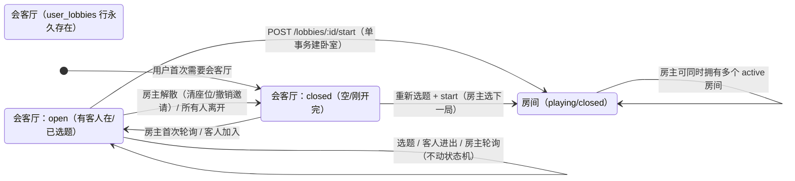

# 房间生命周期（v3：会客厅与卧室彻底解耦）

版本：2026-10-02。v1 确立一房一题与多房间规则；v2 把「开房组队」改为内存等待室，但「房主对等待室单例」被耦合到进程内存，API 重启会丢、auto-recreate 把逻辑拉成三层兜底；v3 把会客厅实体下沉到数据库（lobby id 永久不变、host_user_id UNIQUE 物理保证单例），与房间（卧室）生命周期彻底解耦。本文是唯一有效规则源；实现与本文冲突时以本文为准。

## 一、产品规则

1. **一房一题**。一个房间实体只承载一道海龟汤及其全部提问、讨论、提示、成员和事件。破解成功或房主公布汤底时房间进入终态并归档；历史仍可按权限查看，不能再写入游戏内容。

2. **会客厅（lobby）** 是用户的常驻资源，每个用户固定一个 `user_lobbies` 行，`host_user_id UNIQUE` 物理保证 1:1。会客厅 id 永久不变——服务重启、用户离开、再次访问都拿到同一个 lobby。**用户也可以同时是其他 lobby 的成员**（作为客人加入别人的等待室）。

3. **房间（room）没有数量限制**。房主可以同时拥有任意多个 active 房间作为房主：上一个房间还在 playing 时，他可以在自己的会客厅里选下一个题、开始下一局。会客厅不锁房间，房间不锁会客厅。

4. **房间无痕**。`POST /lobbies/:id/start` 是会客厅 → 卧室的唯一入口。单事务内：锁会客厅行 → 重验题目已发布 → 建卧室（playing）+ 房主成员 + 迁移会客厅里的客人成员 → 建局 + 局参与者 → `round.started` 事件 → 会客厅回到 `status='closed'`、清临时态、删座位、撤销邀请。

5. **踢人硬删**。`kick` = `DELETE FROM lobby_members WHERE ...`，不留 `kicked_at`/`status='kicked'`。下一次同一邀请 token 重新加入直接成功——被踢是这次游戏的，不是永久的。

6. **解散路径**。`DELETE /lobbies/:id`（房主主动）：删座位、revoke 所有未过期邀请、lobby 行 `status='closed'`、清空选题、关闭时间戳。**lobby 行不删**，id 永久保留。

7. **邀请生命周期**。会客厅邀请 = `lobby_invites.token_hash` 行，跟 lobby 行绑定：
   - 创建：`POST /lobbies/:id/invite`，生成 24h 随机 hex（16 随机字节 → 32 字符）。
   - 失效：`expires_at` 到期 / `revoked_at` 写入 / lobby 行被删（账号注销 CASCADE）/ 重建新邀请时旧邀请 revoke。
   - **三种触发 revoke 的代码路径**：`createInvite` 重置时、`dismiss()` 解散时、`start()` 开局时。

8. **邀请链接形式**：URL 路径明确区分，按绑定对象类型走：
   - `https://<host>/lobby/invite/<hex>` → SPA → `GET /api/v1/invites/lobby/<hex>`（只查 `lobby_invites`）
   - `https://<host>/room/invite/<hex>` → SPA → `GET /api/v1/invites/room/<hex>`（只查 `rooms.invite_token_hash`）
   - **无 fallback**——同 hex 不可能在两个表都中，前端按 URL 类型走固定 endpoint，不会被错配。

9. **加入路径**。`POST /lobbies/join` 凭会客厅 token 加入座位表，幂等（已在座位上直接返）；不查 kicked（行不在 → 重新加入直接成功）；不锁任何活跃房间；返 `{ lobbyId }` 不再返 `startedRoomId`（之前会把客人拽进上一局，已移除——lobby 与 room 生命周期独立）。

10. **再选下一题**。会客厅上一局已结束后，房主可以重新选题 `POST /lobbies/:id/select` —— `select()` 现在不阻止任何状态（之前因 `startedRoomId` 指向 playing 房间拒房主换题，已移除）；只校验选题是否 published。房主选完题 + start = 创建新房间。

11. **房主永远在场**。`snapshot` 把房主作为虚拟成员返回（joinedAt=0 排最前），不依赖 `lobby_members` 行。`start` 事务把房主 + 客人都插入 `round_participants`（房主在 `lobby_members` 里没有，但作为 host 同样拥有本局历史阅读权与提问权——之前房主发问会 403，已修复）。

12. **单人无限游玩**。单人模式不设业务频率限制；对话仅存浏览器。

13. **收费顺序**。先保证房间生命周期与免费次数正确性；真实收款仍是收费上线前的独立任务，收款入口保持关闭。

## 二、生命周期



**关键不变量**：

- `user_lobbies.host_user_id UNIQUE`：物理保证 1:1，无业务层单例 Map。
- `lobby_members` 没有房主行（房主虚拟在场）。轮询 snapshot 加房主。
- `start` 写 `round_participants` 时合并 `host + guests`（Set 去重），房主始终能提问。
- `room_lifecycle` 与 `lobby_lifecycle` 完全独立——房主可以同时拥有 N 个 playing 房间 + 1 个 lobby。

## 三、Schema 落地

```sql
-- 0001_lobbies.sql（新库迁移）
CREATE TABLE user_lobbies (
  id uuid PK DEFAULT gen_random_uuid(),
  host_user_id text NOT NULL UNIQUE REFERENCES "user"(id) ON DELETE CASCADE,
  status lobby_status NOT NULL DEFAULT 'closed',  -- 'closed' | 'open'
  capacity integer NOT NULL DEFAULT 8,
  selected_puzzle_id text,
  selected_puzzle_lang text,
  selected_puzzle_title text,
  selected_puzzle_surface text,
  created_at timestamptz DEFAULT now(),
  opened_at timestamptz,
  closed_at timestamptz
);

CREATE TABLE lobby_members (
  lobby_id uuid NOT NULL REFERENCES user_lobbies(id) ON DELETE CASCADE,
  user_id text NOT NULL REFERENCES "user"(id),
  joined_at timestamptz DEFAULT now(),
  PRIMARY KEY (lobby_id, user_id)
);

CREATE TABLE lobby_invites (
  id uuid PK DEFAULT gen_random_uuid(),
  lobby_id uuid NOT NULL REFERENCES user_lobbies(id) ON DELETE CASCADE,
  token_hash text NOT NULL UNIQUE,
  created_at timestamptz DEFAULT now(),
  expires_at timestamptz NOT NULL,
  revoked_at timestamptz
);
```

**为什么不存 `started_room_id`**：lobby 与房间生命周期独立——会客厅不该知道自己的房主最近开了哪些房。「上局房间是 X」这类历史展示不在 lobby 职责内，需要时另起 `lobby_room_history` 表。

## 五、API 路由

| 方法 | 路径 | 作用 |
| --- | --- | --- |
| POST | `/lobbies` | 拿我的会客厅（没有就建一个） |
| GET | `/lobbies/:lobbyId` | 轮询快照（成员、在线、已选题） |
| POST | `/lobbies/:lobbyId/select` | 房主选题 |
| POST | `/lobbies/:lobbyId/invite` | 房主生成/重置邀请（返 `{ token, kind: 'lobby' }`） |
| POST | `/lobbies/:lobbyId/leave` | 非房主离开（删座位） |
| POST | `/lobbies/:lobbyId/kick` | 房主踢人（DELETE 座位行） |
| DELETE | `/lobbies/:lobbyId` | 房主解散（清座位、撤销邀请、清临时态） |
| POST | `/lobbies/:lobbyId/start` | 开局（会客厅 → 卧室唯一入口） |
| POST | `/lobbies/join` | 凭 lobby token 加入座位 |
| GET | `/invites/lobby/:token` | 预览会客厅邀请 |
| GET | `/invites/room/:token` | 预览房间邀请 |

## 六、与 v2 的关键差异

| 维度 | v2（内存） | v3（DB） |
| --- | --- | --- |
| 会客厅存储 | 进程内存 Map（`lobbies` / `hostIndex`） | DB 表 `user_lobbies` |
| 单例实现 | `Map<hostUserId, lobbyId>` 业务逻辑 | `host_user_id UNIQUE` 物理保证 |
| API 重启 | lobby 全丢 + auto-recreate 兜底 | lobby 永久存在 |
| 多实例部署 | 不支持（文档明确写） | 直接支持 |
| 踢人语义 | `kicked: Set<userId>` 软标记 | `DELETE FROM lobby_members` 物理删 |
| 重选下一题 | 上一局状态不影响 | 上一局状态不影响（`startedRoomId` 已移除） |
| 房间无限制 | 同 lobby 阻塞选新题/解散 | 房间与会客厅完全独立 |
| 邀请链接 | JWT 形状区分 lobby/room + 后端 fallback | URL 路径明确区分，无 fallback |

## 七、验收场景

1. 用户首次点「开房间」 → 第一次 INSERT `user_lobbies` 行（`status='closed'`），跳转 `/lobbies/:lobbyId` 看到空会客厅。
2. 用户关闭浏览器再点「开房间」 → 拿到同一 lobby id，看到空会客厅（DB 行永久）。
3. 同一用户开完一局后回到 lobby → lobby 行存在（id 不变），选题 + start → 创建新房间。
4. 上一局 playing 时房主想选下一题 → 在 lobby 选新题不阻塞，start 创建新房间，原房间继续 playing。
5. 用户也可以同时是别人 lobby 的成员（userId 在其他 lobby 的 `lobby_members` 里）——两个 lobby 同时存在，不冲突。
6. 房主在房间里向 jev 发问 → `round_participants` 有房主行（`start` 事务合并 host + guests），不再 403。
7. 邀请链接：lobby 邀请 → `/lobby/invite/<hex>` → 只查 `lobby_invites`；room 邀请 → `/room/invite/<hex>` → 只查 `rooms.invite_token_hash`；revoke 后的 token 返 404。
8. 房主解散 lobby → lobby 行保留（`status='closed'`），座位清空，邀请 revoke，id 可访问。
9. 房主踢人 → DELETE 座位行；同一邀请 token 重新加入直接成功（无 kicked 软标记）。
10. 房间/会客厅邀请端点路由明确分开，同 hex 不会误配另一类型。